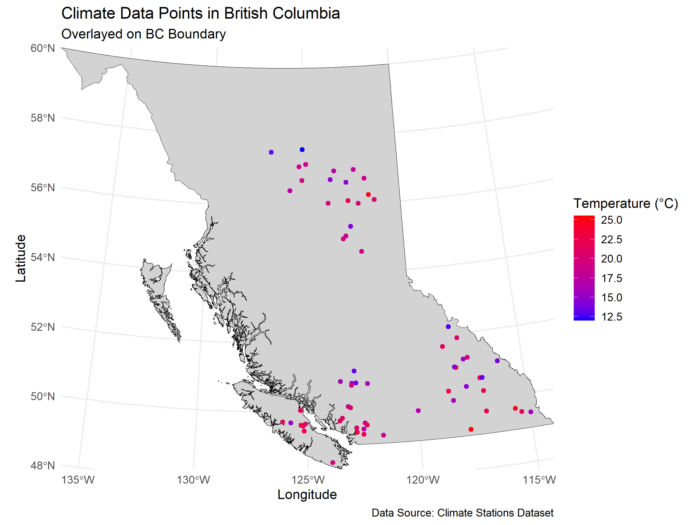
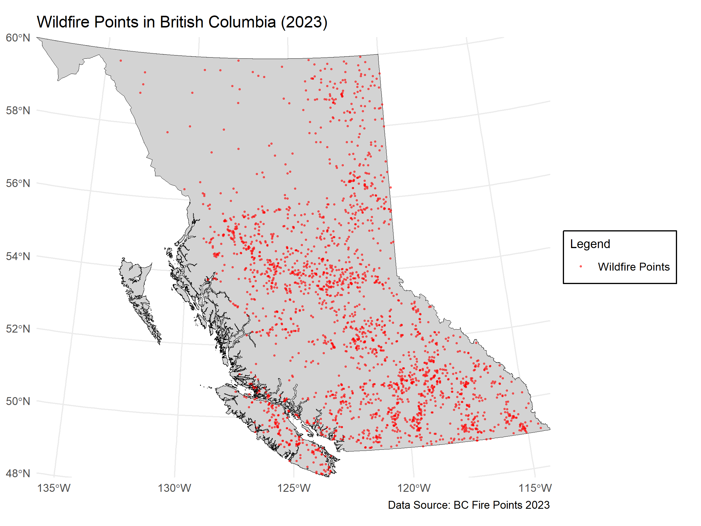

Geog418_FinalProject_Tutorial_AnnaB
# Lab 4 Final Project: Spatial Analysis of Wildfires in BC
Author: Anna Bartnik

# 1. Introduction
## Background
British Columbia (BC) is prone to various climate-mediated events, including wildfires, which pose significant risks to both people and infrastructure. In recent years, the province has seen an increase in wildfire activity, largely attributed to rising temperatures, drought conditions, and changing precipitation patterns driven by climate change. Understanding the spatial distribution of these fires, as well as the climate factors that contribute to their occurrence, is essential for developing effective emergency management strategies aimed at minimizing property loss, injuries, and fatalities.

Temperature, in particular, plays a critical role in wildfire occurrence and intensity. For instance, higher temperatures can increase the likelihood of fire ignition and accelerate fire spread. However, analyzing the relationship between climate factors (such as temperature) and wildfire events requires careful spatial analysis. This tutorial aims to guide users through the process of spatial analysis using poorly distributed climate data and wildfire event data, showing how such data issues can lead to misleading conclusions when applying spatial regression and interpolation techniques.

## Problem Statement
Spatial analysis of climate data, particularly when investigating events like wildfires, is often challenged by the following issues:

Data clustering: When data points are overly concentrated in certain areas (e.g., wildfire occurrences clustered near urban areas), it can distort the analysis, leading to inaccurate results. Clustering can mask underlying trends and biases spatial models.

Data quality: Poor-quality data, such as missing values, inconsistencies, or low resolution, can undermine the reliability of spatial regression and interpolation methods, making it difficult to draw meaningful conclusions from spatial analyses.

## Research Question:
How does spatial autocorrelation in poorly distributed datasets affect the assumptions and outcomes of regression and spatial interpolation techniques used to analyze climate impacts on wildfire events in British Columbia?

## Objectives
This tutorial aims to provide a step-by-step guide on performing spatial analyses while highlighting how data clustering and poor data quality can influence the results. The specific objectives include:

* Reading spatial data: Learn how to read in different types of spatial data (e.g., shapefiles, CSV files) and clean multiple datasets.

* Point pattern analysis and spatial autocorrelation: Understand how to conduct point pattern analysis and assess spatial autocorrelation in poorly distributed datasets.

* Spatial interpolation: Learn how to apply spatial interpolation techniques and explore their limitations in the context of data clustering.Techniques such as Inverse Distance Weighting, and Kriging/ shoudl i inclue ordinary kriging????

* Regression analysis: Explore how spatial autocorrelation impacts regression models, and assess the validity of these models when the underlying data quality is low.

* Evaluating results: understand the impact of clustering and data quality on spatial analyses.

Through these steps, the tutorial will demonstrate not only how to perform the analyses but also how poor data quality can lead to incorrect assumptions and biased outcomes, encouraging a more critical approach to spatial analysis in climate studies.

# Getting Started:
Before beginning the analysis, ensure that the necessary libraries for spatial data manipulation and visualization are installed and loaded. These libraries include:
```{r setup and loading libraries, include=FALSE}
# Ensure installation of these packages before proceeding. 
install.packages(tmap)
install.packages(spdep)
install.packages(raster)
install.packages(sf)
install.packages(lubridate)
install.packages(dplyr)
install.packages(gstat)
install.packages(ggplot2)
install.packages(maps)
install.packages(viridis)
install.packages(spgwr)

# Next Load all necessary Packages:
library(tmap)
library(spdep)
library(raster)
library(sf)
library(lubridate)
library(dplyr)
library(gstat)
library(ggplot2)
library(maps)
library(viridis)
library(spgwr)
```

# Set working directory
To ensure the smooth functioning of code throughout the project, set the working directory to the folder where your data and outputs will be stored. Adjust the path based on your file system:
```{r setup working directory, include=FALSE}
dir <- "C:/Users/aabar/Desktop/university/Year5/Geog418_LAB/Lab4" #Change the directory based on the location you save your files to
setwd(dir)
```

# 2. Data  
## Data description 

In this study, three primary datasets are used to analyze the spatial distribution of wildfires in British Columbia, focusing on the influence of climate data and the challenges posed by clustering in poorly distributed datasets.

### Shapefiles: BC Boundary
The first dataset consists of a shapefile of British Columbia, which was downloaded from [insert source here]. Once the shapefile was imported into R, I noticed that the coordinate reference system (CRS) was initially set to EPSG: 3347. For consistency with the climate and wildfire data, the CRS was transformed to EPSG: 3005 (BC Albers), which is suitable for large-scale spatial analysis in British Columbia. This step is crucial when working with shapefiles to ensure proper alignment with other datasets, especially when comparing spatial data across different layers.

The code to load the BC shp boundary and transform the CRS is as follows:
```{r Load BC Boundary 1st time, echo = TRUE, results= 'hide', warning= FALSE, message= FALSE}
# Load BC boundary shapefile
bc_SHP_boundary <- st_read("BC.shp")
#check the crs of the shp
st_crs(bc_SHP_boundary)
# Transform the BC boundary to EPSG: 3005 to ensure a consistent CRS
bc_SHP_boundary <- st_transform(bc_SHP_boundary, crs = 3005)
```

### Wildfire Data: Fire Incident Locations
The wildfire data for this study was obtained from the BC Wildfire Service, which tracks historical wildfire incident locations across the province. The data includes all types of incidents, such as actual fires, suspected fires, and nuisance fires, and is updated annually with new data from the previous fire season.

To use this dataset, I downloaded the KMZ files containing historical wildfire incident points and converted them into shapefiles using an online KMZ-to-SHP conversion tool. As with the BC boundary shapefile, it was essential to ensure that the wildfire data was in the correct CRS for the analysis. After loading the wildfire points shapefile into R, I transformed the CRS to EPSG: 3005 to match the boundary shapefile and climate data.

The code for transforming the wildfire points CRS is as follows:
```{r Load Wild Fire Points 1st time, echo = TRUE, results= 'hide', warning= FALSE, message= FALSE}
# Load the wildfire shapefile
fire_shapefile <- "C:/Users/aabar/Desktop/university/Year5/Geog418_LAB/Lab4/BC_Fire_Points_2023-point.shp"  # Adjust path
fire_points <- st_read(fire_shapefile)
# Check and transform fire points CRS to match BC boundary
st_crs(fire_points)  # Check CRS of fire points
fire_points <- st_transform(fire_points, crs = 3005)  # Transform to EPSG 3005
```
### Climate Station Data: Temperature
The climate data used for this analysis was downloaded from the Pacific Climate Impacts Consortium’s (PCIC) BC Station Data Portal. For the purposes of this tutorial, I selected data from the BC Hydro station network (station ID: BCH), which includes over 150 stations across the province. The dataset contains daily and hourly observations for the year 2023, with the temperature variable being the daily maximum temperature "MAX_TEMP" in °C. This station was chosen specifically to demonstrate highly clustered data, which is important for understanding how spatial autocorrelation and clustering issues can affect spatial analysis.

## Data Cleaning and Preparation:
Before conducting spatial analysis, it’s essential to clean and prepare the raw temperature data. This involves merging station metadata with temperature observations, removing outliers, and filtering for unrealistic values. Properly cleaning the data ensures that our results are accurate and reliable. Once cleaned, we aggregate the hourly temperature data into daily, monthly, and seasonal averages. This step reduces noise caused by short-term temperature fluctuations and highlights broader trends that are more relevant for spatial regression and interpolation techniques.

### Initializing an Empty Climate Data File
To facilitate the merging of station metadata with temperature observations, we’ll first create an empty data file to store aggregated results. This file will act as the central repository for the cleaned and processed temperature data.
```{r Climate Data File, echo = TRUE, results= 'hide', warning= FALSE, message= FALSE}
# Initialize an empty data frame
empty_data <- data.frame(Native.ID = character(), TEMP = numeric(), 
                         Longitude = numeric(), Latitude = numeric(), 
                         stringsAsFactors = FALSE)

# Write to a CSV file
# Check if the file already exists to avoid overwriting
csv_file_name <- "BC_AVG_TEMP.csv"
if (!file.exists(csv_file_name)) {
  write.csv(empty_data, file = csv_file_name, row.names = FALSE)
}

```

By creating this empty file, we ensure that subsequent steps append the cleaned and aggregated temperature data in a consistent format.

### Next, running a For Loop Tool
The raw temperature data from weather stations often includes errors, missing values, and outliers that can distort the analysis. Cleaning this data is critical to ensure that the temperature values used for aggregation and spatial analysis are realistic and meaningful.

*metntion the months its being focused on too and why did i chose the - and + values?* 
Seasonal averages focus on specific periods of interest, such as the wildfire season (May to October). Aggregating data for this period helps in studying the relationship between climate conditions and wildfire patterns.


Here’s what we’ll do in this step: 

* Parse timestamps: Convert the time column to a proper datetime format for grouping and aggregation.
* Filter out invalid values: Remove missing or extreme temperature values (e.g., below -40°C or above 80°C) that are physically unrealistic.
* Ensure consistency: Standardize the structure of the temperature data across all weather stations.
```{r Aggregate Temperature Data, echo = FALSE, message = FALSE, warning = FALSE, results = "hide"}

# List all CSV files in the BCH folder
# The BCH folder contains data from the weather station network
csv_files <- list.files(path = "C:/Users/aabar/Desktop/university/Year5/Geog418_LAB/Lab4/BCH", 
                        pattern = "\\.csv$", 
                        full.names = TRUE)

# Display the list of files to confirm (do this by removing the "#" on the next line:)
#print(csv_files)

# Loop through each CSV file and perform calculations for daily, monthly, and seasonal temperatures
for (file in csv_files) {
  #--- Step 1: Cleaning Climate data ---#
  # Read each CSV file
  # Read the CSV file, skipping the first line (header = TRUE ensures column names are read correctly)
  hourly_data <- read.csv(file, skip = 1, header = TRUE)
  file_name <- file
  
  # Step 2: Adjust the date/time column
  # Convert the time column into a datetime format usable for calculations
  hourly_data$time <- lubridate::ymd_hms(hourly_data$time)
  # Check the class of the time column (debugging/verification)
  class(hourly_data$time)
  
  # Step 3: Clean the MAX_TEMP column
  # Convert MAX_TEMP to numeric and filter out missing values (NA)
  hourly_data$MAX_TEMP <- as.numeric(hourly_data$MAX_TEMP)
  hourly_data <- hourly_data %>%
    filter(!is.na(MAX_TEMP))
  
  # Remove extreme outliers: values above 80°C or below -40°C
  hourly_data <- hourly_data %>%
    filter(MAX_TEMP <= 80 & MAX_TEMP >= -40)
  
# Step 4: Calculate daily average temperature
# Group data by date and calculate the mean MAX_TEMP for each day
daily_avg_temp <- hourly_data %>%
  group_by(date = as.Date(time)) %>%
  summarize(daily_avg_temp = mean(MAX_TEMP, na.rm = TRUE))

# Display daily average temperatures (debugging/verification)
print(daily_avg_temp)

# Step 5: Calculate monthly average temperature
# Group data by year and month, then calculate the monthly mean MAX_TEMP
monthly_avg_temp <- hourly_data %>%
  group_by(year = year(time), month = month(time)) %>%
  summarize(monthly_avg_temp = mean(MAX_TEMP, na.rm = TRUE)) %>%
  ungroup() # Ensure data is not grouped for subsequent operations

# Display monthly average temperatures (debugging/verification)
print(monthly_avg_temp)

# Step 6: Calculate seasonal average temperature (May to October)
# First, filter data for the months from May to October (Fire Season)
average_temp_may_october <- hourly_data %>%
  filter(month(time) >= 5 & month(time) <= 10) %>%
  summarize(TEMP = mean(MAX_TEMP, na.rm = TRUE))  # Replace 'temperature' with your column name

# Display the average temperature for May to October
print(average_temp_may_october)

# --- Part 2: Prepare climate data for merging ---

  # Extract the filename (station ID) from the file path
  file_name <- basename(file_name)                # Get the file name with extension
  file_name_no_ext <- sub("\\.[^.]*$", "", file_name)  # Remove the file extension
  
  # Display the weather station ID (debugging/verification)
  print(file_name_no_ext)
  
  # Step 7: Read the existing climate data file
  # Load the CSV file containing previously stored climate data
  file_path <- csv_file_name
  data <- read.csv(file_path)
  
  # Display the original data (debugging/verification)
  cat("Original Data:\n")
  print(head(data))
  
  # Step 8: Round seasonal average temperature
  # Round the seasonal average temperature to two decimal places
  Roundedtemp <- round(average_temp_may_october, 2)
  
  # Ensure the Native.ID column in the data is of type character
  data$Native.ID <- as.character(data$Native.ID)
  
  # --- Part 3: Append new rows to the climate data ---
  
  # Create a new row with the weather station ID and seasonal average temperature
  new_values <- data.frame(
    Native.ID = file_name_no_ext, 
    TEMP = Roundedtemp, 
    stringsAsFactors = FALSE
  )
  
  # Append the new row to the existing data
  data <- bind_rows(data, new_values)
  print(head(data))
  
  # Display the updated data for verification (optional debugging)
if (interactive()) {
  cat("Updated Data:\n")
  print(head(data))
}
  
  # Step 9: Save the updated data back to the CSV file
  output_file_path <- csv_file_name
  write.csv(data, file = output_file_path, row.names = FALSE)
}


```

### Last of Cleaning Climate Data, Merge Climate and Metadata
After aggregation, we will take the temperature data and merge it with station metadata, which contains location coordinates. This step is crucial for spatial analysis because it links each temperature value to a specific geographic location.

```{r Merge Climate and Metadata, echo = FALSE, message = FALSE}
# Read metadata and climate data
metadata <- read.csv("C:/Users/aabar/Desktop/university/Year5/Geog418_LAB/Lab4/station-metadata-by-history.csv")
climate_data <- read.csv("BC_AVG_TEMP.csv")

# Merge datasets on station ID
merged_data <- merge(metadata, climate_data, by = "Native.ID")

# Clean merged dataset
merged_data <- merged_data %>%
    filter(TEMP <= 100) %>%                                  # Filter out unrealistic temperature values
  rename(Longitude = Longitude.x, Latitude = Latitude.x) %>% # Rename columns for clarity
  select(-ends_with(".y")) %>%                               # Remove redundant columns (with .y suffix)
  na.omit()                                                  # Remove rows with NA values


# Save cleaned data to CSV
write.csv(merged_data, file = "ClimateData.csv", row.names = FALSE)
```

# 3. Study Area and Data Overview
This section will introduce the study area (British Columbia) and outline the datasets you are working with, including climate data and wildfire data. You can briefly describe the source of the data, its spatial coverage, and why it is relevant for the analysis.
One of the key goals of this tutorial is to explore how poorly distributed climate data can lead to clustering issues. To illustrate this, scatterplots or density maps will be used to visualize the spatial distribution of wildfire incidents and climate data points. This visualization helps in understanding the challenges of data clustering and how it may affect the results of spatial regression and interpolation.
(Placeholder: Introduce BC as the study area, with a focus on wildfire and climate station distributions.)

British Columbia (BC), Canada’s westernmost province, is characterized by its vast and diverse landscapes, including coastal rainforests, arid interior plateaus, and mountainous regions. The province experiences varied climatic conditions, ranging from mild coastal weather to harsher continental climates in the interior. This diverse geography and climate make BC an ideal study area for analyzing environmental phenomena such as wildfires and climate variability.

Wildfires are a significant concern in BC due to their increasing frequency and intensity, exacerbated by climate change. The province regularly faces challenges in managing wildfire risks, particularly in regions with dry climates and dense vegetation. This tutorial focuses on the spatial distribution of wildfire incidents and climate data within BC to explore the challenges posed by uneven data distribution and clustering in spatial analysis.

## Creating the Climate Station Map
This section demonstrates how to convert the climate data into a spatial object (shapefile) for visualization.

```{r starting to make maps, echo = FALSE, message = FALSE, warning = FALSE, results = "hide"}
# Load climate data and ensure correct format
climate_data <- read.csv("ClimateData.csv")
climate_data <- climate_data %>%
  mutate(Latitude = as.numeric(Latitude),
         Longitude = as.numeric(Longitude))

# Convert the climate data to an sf object
climate_sf <- st_as_sf(climate_data, coords = c("Longitude", "Latitude"), crs = 4326)

# Transform CRS of climate data to match BC boundary
climate_sf <- st_transform(climate_sf, crs = 3005)

# Write the shapefile to disk, allowing overwriting
st_write(climate_sf, "ClimateData.shp", delete_layer = TRUE)
print("Shapefile has been created: ClimateData.shp")

# Load BC boundary shapefile
bc_SHP_boundary <- st_read("BC.shp") # You should have already done this in the Data section but if you want to load it in again, you must update the CRS. See below:

# Check and transform BC boundary CRS to 3005
st_crs(bc_SHP_boundary)  # Verify CRS of BC boundary
bc_SHP_boundary <- st_transform(bc_SHP_boundary, crs = 3005)


```
Next, we will plot the climate stations on the BC shp. boundary and save the map to our directory.
```{r Climate station map, echo = FALSE, message = FALSE, warning = FALSE, results = "hide"}
# Plot the climate station map
ggsave(
  filename = "climate_station_map.png", # File name
  plot = ggplot() + 
    geom_sf(data = bc_SHP_boundary, fill = "lightgrey", color = "black") +
    geom_sf(data = climate_sf, aes(color = TEMP), size = 1.5) + 
    scale_color_gradient(low = "blue", high = "red", name = "Temperature (°C)") +
    theme_minimal() +
    labs(
      title = "Climate Data Points in British Columbia",
      subtitle = "Overlayed on BC Boundary",
      x = "Longitude",
      y = "Latitude",
      caption = "Data Source: Climate Stations Dataset"
    ) +
    coord_sf(expand = FALSE),
  width = 8,   # Width in inches
  height = 6,  # Height in inches
  dpi = 300    # Resolution in dots per inch
)

```
# Climate Station Map

*Figure 1: Spatial distribution of climate stations in British Columbia.* This map shows the spatial distribution of climate stations across British Columbia.

## Creating the Wildfire Point Data Map
Data Preparation and Shapefile Transformation
This section explains how to read and transform the wildfire shapefile into the same CRS as the rest of the spatial data.
\newpage
```{r wildfire map, echo = FALSE, message = FALSE, warning = FALSE, results = "hide"}
# Load wildfire data shapefile
# You should have already done this in the Data section but if you want to load it in again, you must update the CRS. See below:
fire_shapefile <- "C:/Users/aabar/Desktop/university/Year5/Geog418_LAB/Lab4/BC_Fire_Points_2023-point.shp"  # Adjust path
fire_points <- st_read(fire_shapefile)

# Transform fire points CRS to match BC boundary
fire_points <- st_transform(fire_points, crs = 3005)
```
Next, we will plot the WildFire points on the BC shp. boundary and save the map to our directory.
```{r wildfire map printing, echo = FALSE, message = FALSE, warning = FALSE, results = "hide"}
# Load wildfire data shapefile
# Create a map with wildfire points
# Save the wildfire map as a PNG file
ggsave(
  filename = "wildfire_points_map.png", # File name
  plot = ggplot() +
    geom_sf(data = bc_SHP_boundary, fill = "lightgrey", color = "black") +  
    geom_sf(data = fire_points, aes(color = "Wildfire Points"), size = 0.5, alpha = 0.5) +  
    scale_color_manual(values = c("Wildfire Points" = "red")) +  
    theme_minimal() +
    labs(
      title = "Wildfire Points in British Columbia (2023)",
      subtitle = "Mapped with BC Boundary",
      caption = "Data Source: BC Fire Points 2023",
      color = "Legend"
    ) +
    theme(
      legend.position = "right",
      legend.background = element_rect(fill = "white", color = "black", linewidth = 0.5),
      legend.title = element_text(size = 10),
      legend.text = element_text(size = 9),
      plot.margin = margin(5, 20, 5, 5)
    ) +
    coord_sf(expand = FALSE),
  width = 8,   # Width in inches
  height = 6,  # Height in inches
  dpi = 300    # Resolution in dots per inch
)

```
# Wildfire Point Data Map


*Figure 2: Locations of wildfire incidents in British Columbia (2023).* This map illustrates the locations of wildfire incidents in British Columbia (2023).

# 4. Methods and Results
## Spatial Interpolation of Climate Data:

## IDW Interpolation
In this section, we will use the Inverse Distance Weighting (IDW) method to interpolate temperature data across British Columbia (BC) and visualize the results. IDW is a spatial interpolation technique where values at unsampled locations are estimated based on a weighted average of nearby sampled points. The influence of each point diminishes with distance from the target location, and this method is often used for climate data because it assumes that nearby locations have more similar values than those farther apart.

Now we will walk through the steps involved, explain their purpose, and provide R code to perform each step.

Load the Climate Data and BC Boundary Shapefiles
Before performing IDW, we need to load the climate data (e.g., temperature measurements from various stations) and the BC boundary shapefile. This allows us to know the geographic extent for which we will perform interpolation and clipping.
```{r loading climate data for IDW, echo = FALSE, message = FALSE, warning = FALSE, results = "hide"}
# Load the climate data and BC boundary shapefiles
climate_data <- st_read("ClimateData.shp")
bc_SHP_boundary <- st_read("BC.shp")

# Transform the BC boundary to EPSG: 3005 to ensure a consistent CRS
bc_SHP_boundary <- st_as_sf(bc_SHP_boundary, coords = c("Longitude", "Latitude"), crs = 3347)
bc_SHP_boundary <- st_transform(bc_SHP_boundary, crs = 3005)
```

Next, we create a grid within the BC boundary extent. The grid will serve as the location for interpolated temperature values. We use the st_make_grid() function to create a spatial grid with a specified cell size (e.g., 25,000 meters). A finer grid would provide more detail but could increase computational complexity.

```{r Create a Grid for Interpolation IDW, echo = FALSE, message = FALSE, warning = FALSE, results = "hide"}
# Create a grid for interpolation within the BC boundary extent
bbox <- st_bbox(bc_SHP_boundary)
grid <- st_make_grid(st_as_sfc(bbox), cellsize = c(25000, 25000))
```
Next, we create a grid within the BC boundary extent. The grid will serve as the location for interpolated temperature values. We use the st_make_grid() function to create a spatial grid with a specified cell size (e.g., 50,000 meters). A finer grid would provide more detail but could increase computational complexity.The IDW method generates continuous predictions for temperature at each point in the grid, providing an estimation for locations where we don’t have observed data. The idp parameter controls the smoothness of the interpolation. After performing the interpolation, the result is returned as a SpatialPointsDataFrame. To work with this result more easily, we convert it into an sf object, which integrates seamlessly with other spatial functions in R.
```{r Actual Interpolation IDW, echo = FALSE, message = FALSE, warning = FALSE, results = "hide"}
# Perform IDW interpolation
idw_result <- gstat::idw(TEMP ~ 1, 
                         locations = climate_data, 
                         newdata = st_as_sf(grid), 
                         idp = 2)

# Convert the result to an sf object for easier handling
idw_sf <- st_as_sf(idw_result)
```
We now visualize the interpolated temperature surface using ggplot2. The geom_sf() function plots the interpolated data, and scale_fill_viridis_c() applies a color scale to the temperature values. This map provides a visual representation of the temperature distribution across BC.

``{r plot IDW, echo = FALSE, message = FALSE, warning = FALSE, results = "hide"}
# Visualize the IDW interpolation
ggplot(data = idw_sf) +
  geom_sf(aes(fill = var1.pred), color = NA) +
  scale_fill_viridis_c(name = "Predicted Temperature (°C)") +
  labs(
    title = "IDW Interpolation of Temperature",
    x = "Longitude",
    y = "Latitude"
  ) +
  theme_minimal() +
  theme(legend.position = "right")

# Save the result as a shapefile for further use
st_write(idw_sf, "IDW_Result.shp", driver = "ESRI Shapefile", delete_dsn = TRUE)

```

#### Clipping Interpolated Results to BC Boundary
Since the IDW interpolation generates temperature predictions for the entire grid, it includes areas outside the BC boundary. To focus on relevant data, we use st_intersection() to clip the results to match the BC boundary. This ensures that only temperature predictions within British Columbia are retained. Clipping the results to the BC boundary prevents irrelevant data from being included and ensures that the final map corresponds only to the area of interest.

\newpage
```{r Clip IDW to BC Boundary, echo = FALSE, message = FALSE, warning = FALSE, results = "hide"}
# Check and align the CRS of the IDW results and BC boundary
crs_idw <- st_crs(idw_sf)
crs_polygon <- st_crs(bc_SHP_boundary)

if (crs_idw != crs_polygon) {
  idw_sf <- st_transform(idw_sf, crs = crs_polygon)
  message("Transformed IDW result CRS to match the BC boundary.")
} else {
  message("CRS of IDW result and BC boundary already match.")
}

# Clip the IDW results to the BC boundary
idw_clipped <- st_intersection(idw_sf, bc_SHP_boundary)

# Plot the clipped interpolation results
ggplot(data = idw_clipped) +
  geom_sf(aes(fill = var1.pred), color = NA) +
  scale_fill_viridis_c(option = "D") +
  labs(
    title = "Clipped IDW Interpolation of Temperature",
    fill = "Temperature (°C)",
    x = "Longitude",
    y = "Latitude"
  ) +
  theme_minimal() +
  theme(legend.position = "right")

# Save the clipped results as a map
ggsave("Clipped_IDW_Interpolation_Map.png", width = 10, height = 8, dpi = 300)
```

#### Summary of IDW Results
The IDW interpolation successfully generated a temperature surface, highlighting variations across British Columbia. Clipping the results to the BC boundary ensured a geographically relevant output, excluding interpolated values for regions outside the province. The final visualization provides a clear representation of predicted temperatures, which can be used for further analysis or comparison with alternative methods like Kriging.

## Kriging
Kriging is a geostatistical interpolation method that generates predictions for unmeasured locations based on spatial autocorrelation. It incorporates both distance and the degree of variation between points, making it a robust method for analyzing climate data. In this section, we will:

1. Fit a variogram to model spatial dependence in the data.
2. Use the fitted variogram for Kriging interpolation.
3. Clip the results to the boundary of British Columbia for spatial relevance.

### Variogram Fitting
To perform Kriging, we first need to fit a variogram, which models how spatial correlation changes with distance. Here, we use a spherical model, which is commonly applied to climate data.
\newpage
```{r onto kriging Variogram Fitting, echo = FALSE, message = FALSE, warning = FALSE, results = "hide"}

# Read and transform data
bc_SHP_boundary <- st_read("BC.shp")
bc_SHP_boundary <- st_transform(bc_SHP_boundary, crs = 3005)
climate_data <- st_read("ClimateData.shp")

# Define the formula for Kriging
f.0 <- as.formula(TEMP ~ 1)

# Create a variogram
var.smpl <- variogram(f.0, climate_data, cloud = FALSE)

# Fit the variogram using a spherical model
dat.fit <- fit.variogram(var.smpl, fit.ranges = TRUE, fit.sills = TRUE,
                         vgm(model = "Sph", nugget = 8, psill = 20, range = 400000))

# Plot the variogram and fitted model
plot(var.smpl, dat.fit)
```


### The fitted variogram provides the parameters required for Kriging, including the nugget, partial sill, and range. These values describe the spatial variability in temperature data.

### Kriging Interpolation
Using the fitted variogram, we generate predicted temperature values for a grid covering the study area. The grid resolution is chosen to balance computational efficiency and spatial detail.

### Summary of Kriging Results
The Kriging interpolation generated a detailed spatial prediction surface for temperature in British Columbia. The clipped raster highlights the temperature distribution within the province, showcasing the utility of geostatistical methods in climate analysis. The visualization provides a robust foundation for understanding temperature variability across the region.
\newpage
```{r trying all kriging at once before party, echo = FALSE, message = FALSE, warning = FALSE, results = "hide"}
#-----onto kriging! ----#

# Create a regular grid for interpolation
cellsize <- 25000  # Resolution of grid
grd <- st_make_grid(st_bbox(bc_SHP_boundary), cellsize = cellsize, what = "centers")
grd <- st_as_sf(grd, crs = st_crs(bc_SHP_boundary))
grd_sp <- as(grd, "Spatial")  # Convert to SpatialPoints for kriging

# Perform Kriging interpolation
dat.krg <- krige(f.0, as(climate_data, "Spatial"), grd_sp, dat.fit, debug.level = 0)

# Convert Kriging results to raster
kriging_df <- as.data.frame(dat.krg)
colnames(kriging_df) <- c("x", "y", "var1.pred")
predicted_raster <- rasterFromXYZ(kriging_df[, c("x", "y", "var1.pred")], crs = st_crs(climate_data)$proj4string)

# Clip the Kriging raster to BC boundary
clipped_raster <- mask(predicted_raster, as_Spatial(bc_SHP_boundary))

# Visualize the clipped raster
tm_shape(clipped_raster) +
  tm_raster(palette = viridis(10), title = "Predicted Temperature (Clipped)") +  # Add title for legend
  tm_shape(bc_SHP_boundary) +
  tm_borders(col = "black", lwd = 1) +
  tm_layout(
    title = "Clipped Kriging Results for Temperature",  # Main plot title
    title.size = 1.2,
    title.position = c("center", "top"),
    legend.position = c("left", "bottom")  # Change legend position here
  ) +
  tm_compass(position = c("right", "top")) +
  tm_scale_bar(position = c("left", "bottom"))


```


## Density Map Creation Section:

Start from here to create the density map, which is the core of your spatial analysis:
\newpage
```{r density map2, echo = FALSE, message = FALSE, warning = FALSE, results = "hide"}

# Load your point data (make sure to adjust the path). Here we use a wildfire dataset from the BC Data Catoluge called C_FIRE_PNT_point and our BC Boundary file.
C_FIRE_PNT_point <- st_read("BC_Fire_Points_2023-point.shp")
bc_SHP_boundary <- st_transform(st_read("BC.shp"),crs=3005)  # Ensure the path is correct
st_crs(C_FIRE_PNT_point)
C_FIRE_PNT_point <- st_transform(C_FIRE_PNT_point, crs=3005)
st_crs(bc_SHP_boundary)

# Ensure bbox2 is valid and formatted correctly
bbox2 <- st_bbox(bc_SHP_boundary)

raster_res <- 100000  # This resolution in 100000 meters 
raster_template <- raster(extent(bbox2), res = c(raster_res, raster_res))


# Estimate density using kernel density estimate
density_raster <- raster::rasterize(st_as_sf(C_FIRE_PNT_point), raster_template, fun = "count", field = 1)

# Ensure all NAs are turned to zeros in the raster
density_raster[is.na(density_raster)] <- 0

# Convert the raster to a data frame and replace any potential NAs with zeros
density_df <- as.data.frame(density_raster, xy = TRUE)
density_df[is.na(density_df)] <- 0  # Replace NAs in the data frame with zeros

# Step to rename the 'layer' column to 'fires' if applicable
colnames(density_df)[colnames(density_df) == "layer"] <- "fires"

# Convert to a spatial points data frame using sf (if needed later)
density_sf <- st_as_sf(density_df, coords = c("x", "y"), crs = st_crs(bc_SHP_boundary))

st_crs(density_sf)

# Plotting the density map with the polygon boundary
ggplot() +
  geom_raster(data = density_df, aes(x = x, y = y, fill = fires)) +  # Use 'fires' from the data frame
  geom_sf(data = bc_SHP_boundary, fill = NA, color = "black") + # Boundary polygon
  scale_fill_viridis_c(option = "plasma") +  # Using a color scale
  theme_minimal() +
  labs(title = "Density Map of Fire Points",
       x = "Longitude",
       y = "Latitude",
       fill = "Density")
```


#### Outputting and Saving the Results:

You then save the results of the density map to a shapefile and generate another visualization for confirmation:
```{r density map3, echo = FALSE, message = FALSE, warning = FALSE, results = "hide"}
# Write to a shapefile
st_write(density_sf, "density_points.shp", delete_dsn = TRUE)

# Create a simple map
ggplot() +
  geom_sf(data = bc_SHP_boundary, fill = NA, color = "black") +  # Plot the boundary polygon
  geom_sf(data = density_sf, aes(color = fires), size = 1) +  # Plot the density points with color mapping
  scale_color_viridis_c(option = "plasma", name = "Density of Fires") +  # Color scale for density values
  theme_minimal() +
  labs(title = "Density of Fires within Boundary",
       x = "Longitude",
       y = "Latitude")

```


### Combining Climate and Events Data
In this section, the climate data and event density data are combined by performing a spatial join. This allows us to analyze the relationship between temperature and the number of events (fires). The following steps outline the data processing workflow:

### Spatial Join and Data Preparation
The spatial join was performed to overlay the event density values onto the interpolated climate surface. This ensures that each polygon in the interpolated surface includes information about nearby event densities.

```{r spatial-join, echo=TRUE, message=FALSE, warning=FALSE, results = "hide"}
# Perform the spatial join
joined_data <- st_join(idw_clipped, density_sf, join = st_intersects)

# Select needed columns
final_data <- joined_data[, c("var1.pred", "fires")]

# Rename column for clarity
final_data <- final_data %>%
  rename(temperature = var1.pred)

# Replace NA values in the 'fires' column with 0
final_data <- final_data %>%
  mutate(fires = ifelse(is.na(fires), 0, fires))
```

### Visualizing the Combined Data
A map was created to visualize the spatial distribution of temperature and events. The map highlights areas of higher event density, providing insights into possible correlations with temperature.
```{r create climate data map , echo = FALSE, message = FALSE, warning = FALSE, results = "hide"}
# Create the map
ggplot(data = final_data) +
  geom_sf(aes(fill = fires)) +
  scale_fill_viridis_c(option = "C") +
  theme_minimal() +
  labs(
    title = "Spatial Distribution of Temperature and Events",
    fill = "Event Density"
  ) +
  theme(legend.position = "right")
# Save final_data as a shapefile
st_write(final_data, "final_data.shp", delete_dsn = TRUE)

# Convert final_data to a data frame
final_data_df <- st_drop_geometry(final_data)

# Write as CSV
write.csv(final_data_df, "final_data.csv", row.names = FALSE)
```


## Performing Ordinary Least Squares (OLS) Regression
Ordinary Least Squares (OLS) regression was applied to analyze the relationship between temperature and the frequency of events (fires). The analysis includes model fitting, residual calculation, and spatial visualization to assess model performance.

#### Data Preparation
The spatial data containing temperature and fire information was read into R. Residuals from the OLS model were calculated and added back to the spatial data for further analysis.
\newpage
```{r OLS regression, echo=FALSE, message=FALSE, warning=FALSE, results = "hide"}
# Read the shapefile
final_data_sf <- st_read("final_data.shp")
st_crs(final_data_sf)

# Fit the OLS regression model on the entire spatial data
# Use "temprtr" instead of "temperature"
ols_model <- lm(fires ~ temprtr, data = final_data_sf)

# Add residuals to the original spatial data frame
final_data_sf$residuals <- resid(ols_model)

# Inspect the updated spatial object to verify residuals are added
print(head(final_data_sf))

# (Optional) Save the updated shapefile with residuals
st_write(final_data_sf, "final_data_with_residuals.shp", delete_dsn = TRUE)

# Create a map of residuals from the OLS regression
ggplot(data = final_data_sf) +
  geom_sf(aes(fill = residuals)) + # Map the residuals to fill color
  scale_fill_viridis_c(option = "C", name = "Residuals") + # Use a color scale
  theme_minimal() +
  labs(title = "Map of Residuals from OLS Regression",
       fill = "Residuals") +
  theme(legend.position = "right")

# Optional: Save the plot if desired
ggsave("residuals_map.png", width = 10, height = 8, dpi = 300)
```


## Geographically Weighted Regression (GWR) Analysis
GWR was applied to explore the spatial variability in the relationship between temperature (`temprtr`) and the number of fires. Two versions of GWR were implemented: one using a fixed bandwidth of 200 km and another using an optimal bandwidth determined by Ben's code.
o analyze the spatial relationship between temperature (`temprtr`) and the number of fires, two GWR models were created:  
1. **Fixed Bandwidth Model:** A consistent spatial influence (200 km bandwidth).  
2. **Optimal Bandwidth Model:** The bandwidth automatically determined using `gwr.sel`.

### Data Preparation
Spatial data was read and prepared for GWR by creating neighborhood structures, converting the data to a suitable spatial format, and ensuring numeric variables for analysis.
```{r data-preparation, echo=FALSE, message=FALSE, warning=FALSE, results = "hide"}
# Read the shapefile (with residuals included)
final_data_sf <- st_read("final_data.shp")

# Preview the data
print(head(final_data_sf))
print(colnames(final_data_sf))

# Convert the sf object to Spatial object
final_data_sp <- as_Spatial(final_data_sf)

# Create neighborhood structure
neighbors <- poly2nb(final_data_sp, queen = TRUE)

# Check for any issues in neighborhood structure
print(summary(neighbors))
if (any(sapply(neighbors, length) == 0)) {
  warning("Some polygons have no neighbors. This may cause issues for GWR.")
}
```

### GWR with Fixed Bandwidth
A fixed bandwidth of 200 km was used to perform GWR. This method applies the same spatial influence across all locations.

Model Results
The fixed bandwidth GWR model coefficients and their spatial distribution are visualized below.
\newpage
```{r GWR fixed Bandwidth, echo=FALSE, message=FALSE, warning=FALSE, results = "hide"}
# Prepare variables
dependent_var <- final_data_sp@data$fires
independent_vars <- final_data_sp@data$temprtr

# Fixed bandwidth GWR
fixed_bandwidth <- 200000  # Bandwidth in meters (200 km)
gwr_model_fixed <- gwr(dependent_var ~ independent_vars, 
                       data = final_data_sp, 
                       bandwidth = fixed_bandwidth, 
                       se.fit = TRUE)

# Validate model
if (is.null(gwr_model_fixed) || is.null(gwr_model_fixed$SDF)) {
  stop("The GWR model with fixed bandwidth did not run successfully.")
}

# Extract coefficients
gwr_results_fixed <- as.data.frame(gwr_model_fixed$SDF)

# Extract coordinates and combine with results
coordinates_fixed <- st_coordinates(st_centroid(final_data_sf))
gwr_results_fixed <- cbind(gwr_results_fixed, coordinates_fixed)

# Convert to sf for visualization
gwr_output_sf_fixed <- st_as_sf(gwr_results_fixed, coords = c("X", "Y"), crs = st_crs(final_data_sf))

# Plot results
ggplot(data = gwr_output_sf_fixed) +
  geom_sf(aes(colour = localR2)) +
  scale_colour_viridis_c(option = "C") +
  labs(title = "GWR Coefficients with Fixed Bandwidth of 200 km",
       colour = "localR2") +
  theme_minimal()

# Save the plot
ggsave("gwr_fixed_bandwidth.png", width = 10, height = 8, dpi = 300)
```


### GWR with Optimal Bandwidth
Using gwr.sel, the optimal bandwidth was determined and used for GWR analysis.

\newpage
```{r GWR Optimal Bandwidth, echo=FALSE, message=FALSE, warning=FALSE, results = "hide"}
# Select optimal bandwidth
optimal_bandwidth <- gwr.sel(dependent_var ~ independent_vars, data = final_data_sp)
print(paste("Optimal Bandwidth selected: ", optimal_bandwidth))

# Perform GWR with optimal bandwidth
gwr_model_optimal <- gwr(dependent_var ~ independent_vars, 
                         data = final_data_sp, 
                         bandwidth = optimal_bandwidth, 
                         se.fit = TRUE)

# Extract coefficients
gwr_results_optimal <- as.data.frame(gwr_model_optimal$SDF)

# Extract centroids for visualization
coordinates_optimal <- st_coordinates(st_centroid(final_data_sf))
gwr_results_optimal <- cbind(gwr_results_optimal, coordinates_optimal)

# Convert to sf object for visualization
gwr_output_sf_optimal <- st_as_sf(gwr_results_optimal, coords = c("X", "Y"), crs = st_crs(final_data_sf))

# Plot results
ggplot(data = gwr_output_sf_optimal) +
  geom_sf(aes(colour = localR2)) +
  scale_colour_viridis_c(option = "C") +
  labs(title = "GWR Coefficients with Optimal Bandwidth",
       colour = "localR2") +
  theme_minimal()

# Save the plot
ggsave("gwr_optimal_bandwidth.png", width = 10, height = 8, dpi = 300)

```


# 6. Discussion

# 7. Room For Improvement

# 8. conclusion
