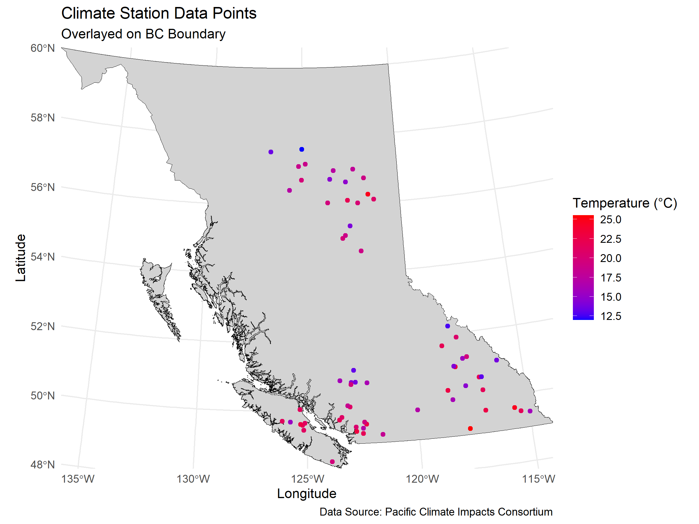
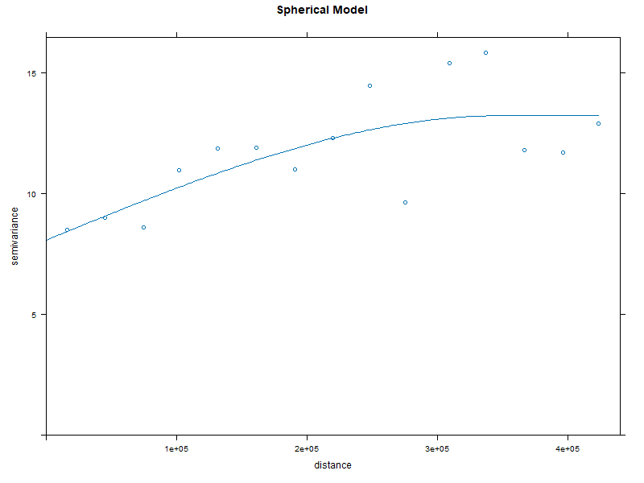
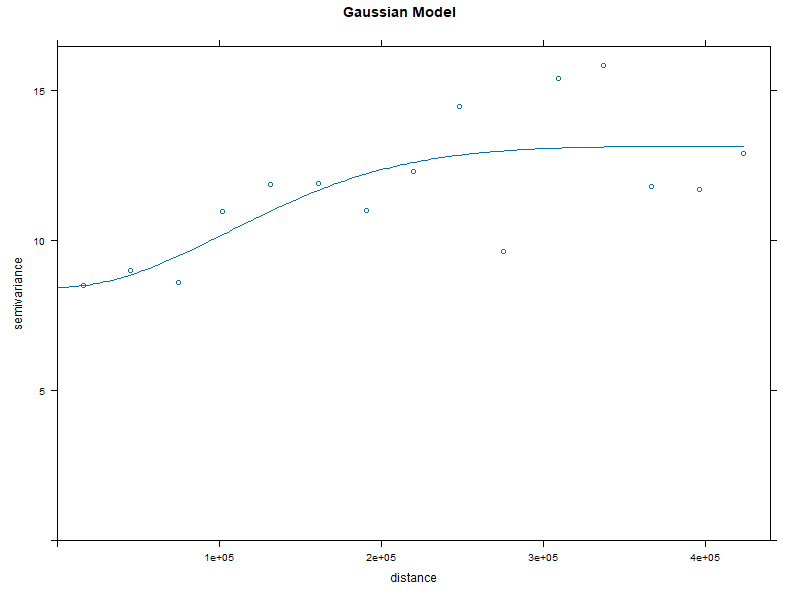
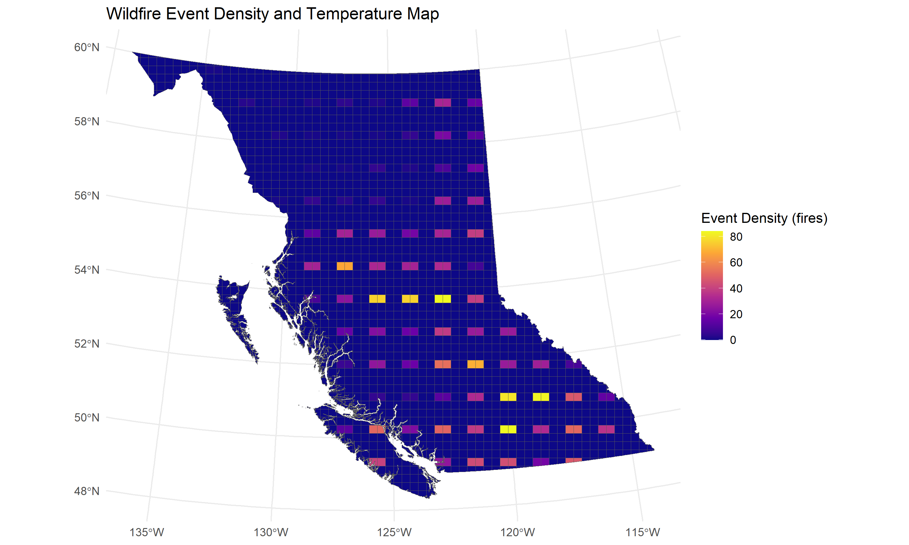
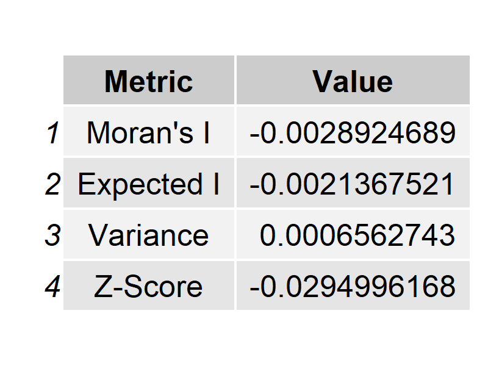
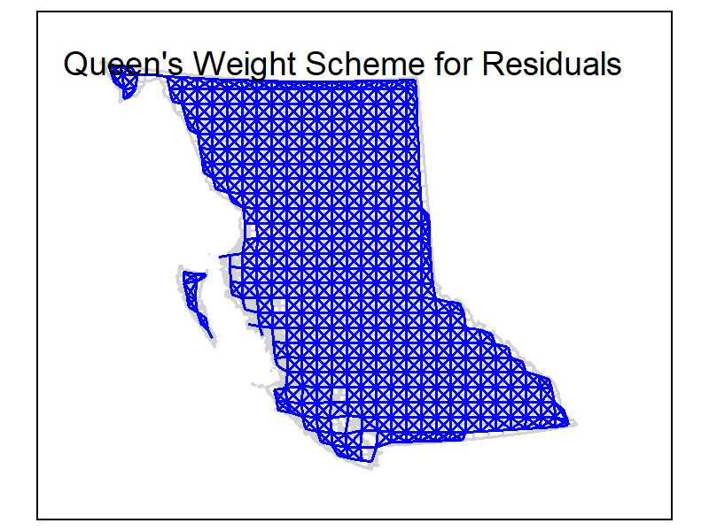
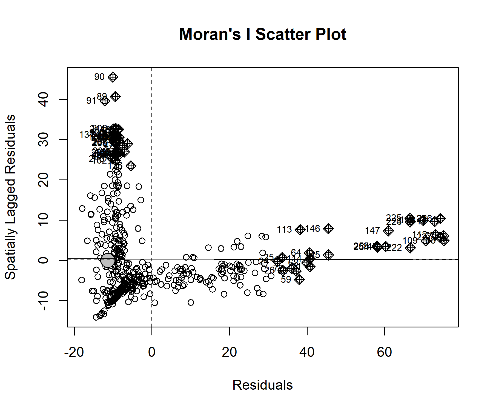

Geog418_FinalProject_Tutorial_AnnaB
# Lab 4 Final Project: Spatial Analysis of Wildfires in BC
Author: Anna Bartnik

# 1. Introduction
### Background
Wildfires have become an increasingly prevalent issue in British Columbia (BC), with the province experiencing an uptick in frequency and intensity in recent years. Much of this rise is linked to climate change, with factors like higher temperatures, drought, and altered precipitation patterns exacerbating wildfire risks. In 2023, BC recorded its largest wildfire season yet, both in terms of the number of fires and the total area burned. With climate change continuing to affect the environment, understanding how climate variables like temperature influence wildfire occurrence and intensity is critical for improving wildfire management strategies.

This tutorial will guide you through a process of spatial analysis using real wildfire event data from the 2023 wildfire season. Temperature is a key variable, as higher temperatures increase the likelihood of fire ignition and promote faster fire spread. However, analyzing the relationship between wildfire events and climate variables is challenging, particularly when the climate data being used is poorly distributed. This is exactly the scenario we'll work through in this tutorial—demonstrating how poorly distributed data can distort the results, no matter how sophisticated the analysis methods are.

### Problem Statement
One of the main challenges we will face in this tutorial is working with poorly distributed climate data. In our case, the climate data comes from only one weather station, located in the southern region of the province. This means that the data is clustered, rather than spread evenly across BC, leaving large gaps where climate conditions are unknown. This clustering introduces bias into the analysis and can make it difficult to make meaningful connections between climate variables and wildfire occurrence across the entire province.

In this tutorial, we will explore the implications of this poor data distribution by applying several spatial statistical techniques, such as interpolation methods like Inverse Distance Weighting (IDW) and Kriging, as well as regression models like Ordinary Least Squares (OLS) and Geographically Weighted Regression (GWR). We’ll also evaluate spatial autocorrelation using Moran’s I, all while acknowledging that the results might be skewed due to the lack of properly distributed data.

### Why Data Quality Matters
In today’s age of freely accessible data, it’s tempting to use whatever information is available online. However, as we’ll see throughout this tutorial, choosing the right data is just as important as the methods used to analyze it. In this case, the limited spatial coverage of the climate data significantly hampers our ability to make reliable conclusions about the relationship between temperature and wildfires. No matter how much statistical power we apply, if the data doesn’t reflect the true diversity of environmental conditions across the region, the results will be incomplete or even misleading.

Our dataset is a prime example of how one small, poorly distributed sample can lead to an inaccurate understanding of a large-scale phenomenon. In contrast, gathering data from a range of sources—particularly data points that cover a larger area—could significantly improve the reliability of spatial analyses.

## Research Question:
How does spatial autocorrelation in poorly distributed climate data influence the assumptions and outcomes of spatial regression and interpolation methods used to analyze temperature impacts on wildfire events in British Columbia?

### Objectives
This tutorial aims to demonstrate how to perform a variety of spatial analyses while working with poory distributed and limited data. The key objectives include:

* Reading and preparing spatial data: Learn how to read and clean climate and wildfire event data for analysis.
* Spatial interpolation: Understand how methods like Inverse Distance Weighting (IDW) and Kriging can be used to estimate temperature values across the province, and examine how the limited spatial coverage affects their accuracy.
* Regression analysis: Explore the use of Ordinary Least Squares (OLS) and Geographically Weighted Regression (GWR) to model the relationship between temperature and wildfire occurrences, and see how the lack of good data distribution affects the model results.
* Spatial autocorrelation: Learn how to assess spatial autocorrelation using Moran’s I to identify patterns in wildfire occurrences and temperature data, and evaluate how data clustering impacts these patterns.
* Evaluating results: Develop a critical understanding of how poor data distribution can influence your spatial analysis, and how to interpret results in this context.

This tutorial will walk you through these techniques, while also demonstrating the limitations of poor data distribution and its impact on the reliability of spatial analysis. By the end, you’ll gain a deeper understanding of the importance of selecting well-distributed data for spatial modeling and how to navigate challenges that arise when working with imperfect datasets.

# Getting Started:
Before beginning the analysis, ensure that the necessary libraries for spatial data manipulation and visualization are installed and loaded. These libraries include:
```{r setup and loading libraries, include=FALSE}
# Ensure installation of these packages before proceeding. 
install.packages("tmap")
install.packages("spdep")
install.packages("raster")
install.packages("sf")
install.packages("lubridate")
install.packages("dplyr")
install.packages("gstat")
install.packages("ggplot2")
install.packages("maps")
install.packages("viridis")
install.packages("spgwr")
install.packages("gridExtra")
install.packages("grid")

# Next Load all necessary Packages:
library(tmap)
library(spdep)
library(raster)
library(sf)
library(lubridate)
library(dplyr)
library(gstat)
library(ggplot2)
library(maps)
library(viridis)
library(spgwr)
library(gridExtra)
library(grid)

```

#### Set working directory
To ensure the smooth functioning of code throughout the project, set the working directory to the folder where your data and outputs will be stored. Adjust the path based on your file system:
```{r setup working directory, include=FALSE}
#CHANGE TO YOUR RESPECTIVE DIRECTORY:

dir <- "C:/Users/aabar/Desktop/university/Year5/Geog418_LAB/Lab4" #Change the directory based on the location you save your files to
setwd(dir)
```

# 2. Data  
## Data description 

In this study, three primary datasets are used to analyze the spatial distribution of wildfires in British Columbia, focusing on the influence of climate data and the challenges posed by clustering in poorly distributed datasets.

### Shapefiles: BC Boundary
The first dataset consists of a shapefile of British Columbia, which was downloaded from [insert source here]. Once the shapefile was imported into R, I noticed that the coordinate reference system (CRS) was initially set to EPSG: 3347. For consistency with the climate and wildfire data, the CRS was transformed to EPSG: 3005 (BC Albers), which is suitable for large-scale spatial analysis in British Columbia. This step is crucial when working with shapefiles to ensure proper alignment with other datasets, especially when comparing spatial data across different layers.

The code to load the BC shp boundary and transform the CRS is as follows:
```{r Load BC Boundary 1st time, echo = TRUE, results= 'hide', warning= FALSE, message= FALSE}
# Load BC boundary shapefile
bc_SHP_boundary <- st_read("BC.shp")
#check the crs of the shp
st_crs(bc_SHP_boundary)
# Transform the BC boundary to EPSG: 3005 to ensure a consistent CRS
bc_SHP_boundary <- st_transform(bc_SHP_boundary, crs = 3005)
```

### Wildfire Data: Fire Incident Locations
The wildfire data for this study was obtained from the BC Wildfire Service, which tracks historical wildfire incident locations across the province. The data includes all types of incidents, such as actual fires, suspected fires, and nuisance fires, and is updated annually with new data from the previous fire season.

To use this dataset, I downloaded the KMZ files containing historical wildfire incident points and converted them into shapefiles using an online KMZ-to-SHP conversion tool. As with the BC boundary shapefile, it was essential to ensure that the wildfire data was in the correct CRS for the analysis. After loading the wildfire points shapefile into R, I transformed the CRS to EPSG: 3005 to match the boundary shapefile and climate data.

The code for transforming the wildfire points CRS is as follows:
```{r Load Wild Fire Points 1st time, echo = TRUE, results= 'hide', warning= FALSE, message= FALSE}
# Load the wildfire shapefile
fire_shapefile <- "C:/Users/aabar/Desktop/university/Year5/Geog418_LAB/Lab4/BC_Fire_Points_2023-point.shp"  # Adjust path
fire_points <- st_read(fire_shapefile)
# Check and transform fire points CRS to match BC boundary
st_crs(fire_points)  # Check CRS of fire points
fire_points <- st_transform(fire_points, crs = 3005)  # Transform to EPSG 3005
```
### Climate Station Data: Temperature
The climate data used for this analysis was downloaded from the Pacific Climate Impacts Consortium’s (PCIC) BC Station Data Portal. For the purposes of this tutorial, I selected data from the BC Hydro station network (station ID: BCH), which includes over 150 stations across the province. The dataset contains daily and hourly observations for the year 2023, with the temperature variable being the daily maximum temperature "MAX_TEMP" in °C. This station was chosen specifically to demonstrate highly clustered data, which is important for understanding how spatial autocorrelation and clustering issues can affect spatial analysis.

## Data Cleaning and Preparation:
Before conducting spatial analysis, it’s essential to clean and prepare the raw temperature data. This involves merging station metadata with temperature observations, removing outliers, and filtering for unrealistic values. Properly cleaning the data ensures that our results are accurate and reliable. Once cleaned, we aggregate the hourly temperature data into daily, monthly, and seasonal averages. This step reduces noise caused by short-term temperature fluctuations and highlights broader trends that are more relevant for spatial regression and interpolation techniques.

#### Initializing an Empty Climate Data File
To facilitate the merging of station metadata with temperature observations, we’ll first create an empty data file to store aggregated results. This file will act as the central repository for the cleaned and processed temperature data.
```{r Climate Data File, echo = TRUE, results= 'hide', warning= FALSE, message= FALSE}
# Initialize an empty data frame
empty_data <- data.frame(Native.ID = character(), TEMP = numeric(), 
                         Longitude = numeric(), Latitude = numeric(), 
                         stringsAsFactors = FALSE)

# Write to a CSV file
# Check if the file already exists to avoid overwriting
csv_file_name <- "BC_AVG_TEMP.csv"
if (!file.exists(csv_file_name)) {
  write.csv(empty_data, file = csv_file_name, row.names = FALSE)
}

```

By creating this empty file, we ensure that subsequent steps append the cleaned and aggregated temperature data in a consistent format.

#### Next, running a For Loop Tool
The raw temperature data from weather stations often includes errors, missing values, and outliers that can distort the analysis. Cleaning this data is critical to ensure that the temperature values used for aggregation and spatial analysis are realistic and meaningful.

*mentioned the months it's being focused on too and why did I chose the - and + values?* 
Seasonal averages focus on specific periods of interest, such as the wildfire season (May to October). Aggregating data for this period helps in studying the relationship between climate conditions and wildfire patterns.


Here’s what we’ll do in this step: 

* Parse timestamps: Convert the time column to a proper datetime format for grouping and aggregation.
* Filter out invalid values: Remove missing or extreme temperature values (e.g., below -40°C or above 80°C) that are physically unrealistic.
* Ensure consistency: Standardize the structure of the temperature data across all weather stations.
```{r Aggregate Temperature Data, echo = FALSE, message = FALSE, warning = FALSE, results = "hide"}

# Create an empty data frame with specified columns
empty_data <- data.frame(Native.ID = character(), TEMP = numeric(), 
                         Longitude = numeric(), Latitude = numeric(), stringsAsFactors = FALSE)

csv_file_name <- "BC_AVG_TEMP.csv"

# Write the empty data frame to a CSV file
write.csv(empty_data, file = csv_file_name, row.names = FALSE)


#Run through all csv files in folder to calculate an aggregate measure of temperature
# List all CSV files in the directory
#First, list all CSV files in the directory to make sure you are in the right folder. The folder we are looking at here is called BCH as this is the weather station network from which the data was obtained in PCIC.
#csv_files <- list.files(pattern = "\\.csv$", full.names = TRUE)
#CHANGE TO YOUR RESPECTIVE DIRECTORY:
csv_files <- list.files(path = "C:/Users/aabar/Desktop/university/Year5/Geog418_LAB/LAB4_SUBMISSION_Test/BCH", pattern = "\\.csv$", full.names = TRUE)


#Next, loop through each CSV file and perform your calculations to calculate something about this variable. Here we calculate daily, montly, and season average temperatures. 
for (file in csv_files) {

  #Step 1: Cleaning Climate data#
  # Read the CSV file, skipping the first line (header = TRUE ensures column names are read correctly)
  hourly_data <- read.csv(file, skip = 1, header = TRUE)
  file_name <- file
  
  # Step 2: Adjust the date/time column
  # Convert the time column into a datetime format usable for calculations
  hourly_data$time <- lubridate::ymd_hms(hourly_data$time)
  # Check the class of the time column (debugging/verification)
  class(hourly_data$time)
  
  # Step 3: Clean the MAX_TEMP column
  # Convert MAX_TEMP to numeric and filter out missing values (NA)
  hourly_data$MAX_TEMP <- as.numeric(hourly_data$MAX_TEMP)
  hourly_data <- hourly_data %>%
    filter(!is.na(MAX_TEMP))
  
  # Remove extreme outliers: values above 80°C or below -40°C
  hourly_data <- hourly_data %>%
    filter(MAX_TEMP <= 80 & MAX_TEMP >= -40)
  
  # Step 4: Calculate daily average temperature
  # Group data by date and calculate the mean MAX_TEMP for each day
  daily_avg_temp <- hourly_data %>%
    group_by(date = as.Date(time)) %>%
    summarize(daily_avg_temp = mean(MAX_TEMP, na.rm = TRUE))
  
  # Display daily average temperatures (debugging/verification)
  print(daily_avg_temp)
  
  # Step 5: Calculate monthly average temperature
  # Group data by year and month, then calculate the monthly mean MAX_TEMP
  monthly_avg_temp <- hourly_data %>%
    group_by(year = year(time), month = month(time)) %>%
    summarize(monthly_avg_temp = mean(MAX_TEMP, na.rm = TRUE)) %>%
    ungroup() # Ensure data is not grouped for subsequent operations
  
  # Display monthly average temperatures (debugging/verification)
  print(monthly_avg_temp)
  
  # Step 6: Calculate seasonal average temperature (May to October)
  # First, filter data for the months from May to October (Fire Season)
  average_temp_may_october <- hourly_data %>%
    filter(month(time) >= 5 & month(time) <= 10) %>%
    summarize(TEMP = mean(MAX_TEMP, na.rm = TRUE))  # Replace 'temperature' with your column name
  
  # Display the average temperature for May to October
  print(average_temp_may_october)

# ----- That was part 1 of cleaning climate Data ----- #

# ----- Part 2: Prepare climate data for merging ----- #
  
  # Extract the filename (station ID) from the file path
  file_name <- basename(file_name)                # Get the file name with extension
  file_name_no_ext <- sub("\\.[^.]*$", "", file_name)  # Remove the file extension
  
  # Display the weather station ID (debugging/verification)
  print(file_name_no_ext)
  
  # Step 7: Read the existing climate data file
  # Load the CSV file containing previously stored climate data
  file_path <- csv_file_name
  data <- read.csv(file_path)
  
  # Display the original data (debugging/verification)
  cat("Original Data:\n")
  print(head(data))
  
  # Step 8: Round seasonal average temperature
  # Round the seasonal average temperature to two decimal places
  Roundedtemp <- round(average_temp_may_october, 2)
  
  # Ensure the Native.ID column in the data is of type character
  data$Native.ID <- as.character(data$Native.ID)
  
  # --- Part 3: Append new rows to the climate data ---
  
  # Create a new row with the weather station ID and seasonal average temperature
  new_values <- data.frame(
    Native.ID = file_name_no_ext, 
    TEMP = Roundedtemp, 
    stringsAsFactors = FALSE
  )
  
  # Append the new row to the existing data
  data <- bind_rows(data, new_values)
  print(head(data))
  
  # Display the updated data for verification (optional debugging)
  if (interactive()) {
    cat("Updated Data:\n")
    print(head(data))
  }
  
  # Step 9: Save the updated data back to the CSV file
  output_file_path <- csv_file_name
  write.csv(data, file = output_file_path, row.names = FALSE)
}

################### Done with for loop tool

```

#### Last of Cleaning Climate Data, Merge Climate and Metadata
After aggregation, we will take the temperature data and merge it with station metadata, which contains location coordinates. This step is crucial for spatial analysis because it links each temperature value to a specific geographic location.

```{r Merge Climate and Metadata, echo = FALSE, message = FALSE}
# Merge the climate data for each station with the location data found in the metadata file
metadata <- read.csv("C:/Users/aabar/Desktop/university/Year5/Geog418_LAB/LAB4_SUBMISSION_Test/station-metadata-by-history.csv")
climatedata <- read.csv("BC_AVG_TEMP.csv")

# Merge datasets on station ID
merged_data <- merge(metadata, climatedata, by = "Native.ID")

# Remove the last two columns which are duplicate Latitude and Longitude
merged_data <- merged_data[, -((ncol(merged_data)-1):ncol(merged_data))]

# Change column names for Latitude and Longitude to remove the x
colnames(merged_data)[colnames(merged_data) %in% c("Latitude.x", "Longitude.x")] <- c("Longitude", "Latitude")

# Omit NA's
merged_data <- na.omit(merged_data)

# There are erroneous temperature values. Filter data to remove these
merged_data <- merged_data[merged_data$TEMP <= 100, ]

# Save cleaned data to CSV
write.csv(merged_data, file = "ClimateData.csv", row.names = FALSE)

#------------ End of cleaning climate data ---------#

```


#### Descriptive statistics of wildfire data in 2023
The descriptive statistics section allows us to explore the general characteristics of wildfire sizes in 2024, both for the full year and for just the summer months (June to August). These statistics include measures of central tendency (mean, median, and mode), dispersion (standard deviation, coefficient of variation), distribution (skewness and kurtosis), and normality tests.
```{r MWildfire descript stats, echo = FALSE, message = FALSE}
# ----- DESCRIPTIVE STATISTICS for Wildfire in 2023 ----- #

# Install and Load necessary libraries
library(dplyr)
library(ggplot2)
library(e1071)
library(spatstat)
library(sf)
library(gridExtra)
library(grid)
library(gtable)

# ----- Wildfire Data -----

# Load the wildfire shapefile
fire_shapefile <- "C:/Users/aabar/Desktop/university/Year5/Geog418_LAB/LAB4_SUBMISSION_Test/BC_Fire_Points_2023-point.shp"
fire_points <- st_read(fire_shapefile)

# Transform CRS to EPSG 3005 (BC Albers)
fire_points <- st_transform(fire_points, crs = 3005)

# Check the structure of the fire points data
str(fire_points)

# Summary statistics for the wildfire data (e.g., year, location, size)
summary(fire_points)

# Number of wildfire points
num_fire_points <- nrow(fire_points)
num_fire_points

# Distribution of fire sizes
fire_points$FIRE_SIZE_ <- as.numeric(fire_points$FIRE_SIZE_)
summary(fire_points$FIRE_SIZE_)

# Distribution plot for fire sizes
hist(fire_points$FIRE_SIZE_, main = "Distribution of Wildfire Sizes", xlab = "Fire Size (hectares)")

# Calculate basic statistics for fire sizes
mean_fire_size <- mean(fire_points$FIRE_SIZE_, na.rm = TRUE)
median_fire_size <- median(fire_points$FIRE_SIZE_, na.rm = TRUE)
sd_fire_size <- sd(fire_points$FIRE_SIZE_, na.rm = TRUE)
cv_fire_size <- sd_fire_size / mean_fire_size  # Coefficient of variation

# Output basic fire size statistics
mean_fire_size
median_fire_size
sd_fire_size
cv_fire_size

# Skewness and kurtosis for fire sizes
fire_size_skewness <- skewness(fire_points$FIRE_SIZE_, na.rm = TRUE)
fire_size_kurtosis <- kurtosis(fire_points$FIRE_SIZE_, na.rm = TRUE)

fire_size_skewness
fire_size_kurtosis

# Spatial density: Kernel Density Estimate (KDE)
# Convert sf object to ppp (point pattern object) for spatstat
fire_points_ppp <- as.ppp(fire_points)

# Compute Kernel Density Estimate (KDE)
fire_kde <- density(fire_points_ppp)

# Plot the KDE to visualize spatial density
plot(fire_kde)

# ----- END of WILDFIRE DESCRIPTIVE STATISTICS ----- #

```

# 3. Study Area and Data Overview
This section will introduce the study area (British Columbia) and outline the datasets you are working with, including climate data and wildfire data. You can briefly describe the source of the data, its spatial coverage, and why it is relevant for the analysis.
One of the key goals of this tutorial is to explore how poorly distributed climate data can lead to clustering issues. To illustrate this, scatterplots or density maps will be used to visualize the spatial distribution of wildfire incidents and climate data points. This visualization helps in understanding the challenges of data clustering and how it may affect the results of spatial regression and interpolation.
(Placeholder: Introduce BC as the study area, with a focus on wildfire and climate station distributions.)

British Columbia (BC), Canada’s westernmost province, is characterized by its vast and diverse landscapes, including coastal rainforests, arid interior plateaus, and mountainous regions. The province experiences varied climatic conditions, ranging from mild coastal weather to harsher continental climates in the interior. This diverse geography and climate make BC an ideal study area for analyzing environmental phenomena such as wildfires and climate variability.

Wildfires are a significant concern in BC due to their increasing frequency and intensity, exacerbated by climate change. The province regularly faces challenges in managing wildfire risks, particularly in regions with dry climates and dense vegetation. This tutorial focuses on the spatial distribution of wildfire incidents and climate data within BC to explore the challenges posed by uneven data distribution and clustering in spatial analysis.

### Creating the Climate Station Map
This section demonstrates how to convert the climate data into a spatial object (shapefile) for visualization.

```{r starting to make maps, echo = FALSE, message = FALSE, warning = FALSE, results = "hide"}
# Load climate data and ensure correct format
climate_data <- read.csv("ClimateData.csv")
climate_data <- climate_data %>%
  mutate(Latitude = as.numeric(Latitude),
         Longitude = as.numeric(Longitude))

# Convert the climate data to an sf object
climate_sf <- st_as_sf(climate_data, coords = c("Longitude", "Latitude"), crs = 4326)

# Transform CRS of climate data to match BC boundary
climate_sf <- st_transform(climate_sf, crs = 3005)

# Write the shapefile to disk, allowing overwriting
st_write(climate_sf, "ClimateData.shp", delete_layer = TRUE)
print("Shapefile has been created: ClimateData.shp")

# Load BC boundary shapefile
bc_SHP_boundary <- st_read("BC.shp") # You should have already done this in the Data section but if you want to load it in again, you must update the CRS. See below:

# Check and transform BC boundary CRS to 3005
st_crs(bc_SHP_boundary)  # Verify CRS of BC boundary
bc_SHP_boundary <- st_transform(bc_SHP_boundary, crs = 3005)


```

Next, we will plot the climate stations on the BC shp. boundary and save the map to our directory.

```{r Climate station map, echo = FALSE, message = FALSE, warning = FALSE, results = "hide"}
# Plot the climate station map
climate_map <- ggplot() + 
  geom_sf(data = bc_SHP_boundary, fill = "lightgrey", color = "black") +
  geom_sf(data = climate_sf, aes(color = TEMP), size = 1.5) + 
  scale_color_gradient(low = "blue", high = "red", name = "Temperature (°C)") +
  theme_minimal() +
  labs(
    title = "Climate Station Data Points",
    subtitle = "Overlayed on BC Boundary",
    x = "Longitude",
    y = "Latitude",
    caption = "Data Source: Pacific Climate Impacts Consortium"
  ) +
  coord_sf(expand = FALSE)

# Print the plot to R
print(climate_map)

# Save the plot to a file
ggsave(
  filename = "climate_station_map.png", # File name
  plot = climate_map,                  # The plot object
  width = 8,                           # Width in inches
  height = 6,                          # Height in inches
  dpi = 300                            # Resolution in dots per inch
)


```
## Climate Station Map

*Figure 1: Spatial distribution of climate stations in British Columbia.* This map shows the spatial distribution of climate stations across British Columbia.

### Creating the Wildfire Point Data Map
Data Preparation and Shapefile Transformation
This section explains how to read and transform the wildfire shapefile into the same CRS as the rest of the spatial data.

```{r wildfire map, echo = FALSE, message = FALSE, warning = FALSE, results = "hide"}
# Load wildfire data shapefile
# You should have already done this in the Data section but if you want to load it in again, you must update the CRS. See below:
fire_shapefile <- "C:/Users/aabar/Desktop/university/Year5/Geog418_LAB/LAB4_SUBMISSION_Test/BC_Fire_Points_2023-point.shp"  # Adjust path
fire_points <- st_read(fire_shapefile)

# Transform fire points CRS to match BC boundary
st_crs(fire_points)  # Check CRS of fire points
fire_points <- st_transform(fire_points, crs = 3005)  # Select CRS of choice. For this tutorial we use 3005

```
Next, we will plot the WildFire points on the BC shp. boundary and save the map to our directory.
```{r wildfire map printing, echo = FALSE, message = FALSE, warning = FALSE, results = "hide"}
# Create the map for wildfire points
wildfire_map <- ggplot() +
  geom_sf(data = bc_SHP_boundary, fill = "lightgrey", color = "black") +  
  geom_sf(data = fire_points, aes(color = "Wildfire Points"), size = 0.5, alpha = 0.5) +  
  scale_color_manual(values = c("Wildfire Points" = "red")) +  
  theme_minimal() +
  labs(
    title = "Wildfire Points in British Columbia (2023)",
    caption = "Data Source: BC Fire Points 2023",
    color = "Legend"
  ) +
  theme(
    legend.position = "right",
    legend.background = element_rect(fill = "white", color = "black", linewidth = 0.5),
    legend.title = element_text(size = 10),
    legend.text = element_text(size = 9),
    plot.margin = margin(5, 20, 5, 5)
  ) +
  coord_sf(expand = FALSE)

# Print the plot to R
print(wildfire_map)

# Save the plot as a PNG file
ggsave(
  filename = "wildfire_points_map.png", # File name
  plot = wildfire_map,                  # The plot object
  width = 8,                            # Width in inches
  height = 6,                           # Height in inches
  dpi = 300                             # Resolution in dots per inch
)

```
## Wildfire Point Data Map


*Figure 2: Locations of wildfire incidents in British Columbia (2023).* This map illustrates the locations of wildfire incidents in British Columbia (2023).

# 4. Methods and Results
### Spatial Interpolation of Climate Data:
Spatial interpolation is a powerful tool in geospatial analysis, allowing us to estimate values at unsampled locations based on measurements taken at known points.

### IDW Interpolation
In this section, we will use the Inverse Distance Weighting (IDW) method to interpolate temperature data across British Columbia (BC) and visualize the results. IDW is a spatial interpolation technique where values at unsampled locations are estimated based on a weighted average of nearby sampled points. IDW assumes that values at nearby locations are more similar than those farther apart, weighting observations inversely proportional to their distance from the target location. The influence of each point diminishes with distance from the target location, and This method is particularly well-suited for climate data, as environmental variables like temperature often exhibit spatial autocorrelation.

The IDW approach calculates the estimated value 
𝑍𝑖 at an unsampled location 
𝑖 as a weighted average of known values 𝑍𝑗


Where: 
* Zj is the known value at sampled location 𝑗
* dij is the distance between locations 𝑖 and 𝑗
* p Power parameter controlling the rate at which influence decreases with distance

The power parameter (𝑝) is critical in determining the smoothness of the interpolation. A higher 𝑝 gives more weight to closer points, leading to sharper transitions in predicted values.

#### Now we will walk through the steps involved, explain their purpose, and provide R code to perform each step.

Preparing Data
We begin by loading the necessary climate data and BC boundary shapefiles. This ensures that the interpolation is confined to the geographic extent of BC. This allows us to know the geographic extent for which we will perform interpolation and clipping.

```{r loading climate data for IDW, echo = FALSE, message = FALSE, warning = FALSE, results = "hide"}
# Load the climate data and BC boundary shapefiles
climate_data <- st_read("ClimateData.shp")
bc_SHP_boundary <- st_read("BC.shp")

# Transform the BC boundary to EPSG: 3005 to ensure a consistent CRS
bc_SHP_boundary <- st_as_sf(bc_SHP_boundary, coords = c("Longitude", "Latitude"), crs = 3347)
bc_SHP_boundary <- st_transform(bc_SHP_boundary, crs = 3005)
```

Next, we create a grid within the BC boundary extent. The grid will serve as the location for interpolated temperature values. We use the st_make_grid() function to create a spatial grid with a specified cell size (e.g., 25,000 meters). A finer grid would provide more detail but could increase computational complexity.

```{r Create a Grid for Interpolation IDW, echo = FALSE, message = FALSE, warning = FALSE, results = "hide"}
# Create a grid for the interpolation. Adjust the extent and resolution of the grid according to your needs
bbox <- st_bbox(bc_SHP_boundary)
grid <- st_make_grid(st_as_sfc(bbox), cellsize = c(25000, 25000))
```
Next, we run the idw calculation and generate continuous predictions for temperature at each point in the grid, providing an estimation for locations where we don’t have observed data. The idp parameter controls the smoothness of the interpolation. After performing the interpolation, the result is returned as a SpatialPointsDataFrame. To work with this result more easily, we convert it into an sf object, which integrates seamlessly with other spatial functions in R.

```{r Actual Interpolation IDW, echo = FALSE, message = FALSE, warning = FALSE, results = "hide"}
#Next, we run the idw calculation and generate continuous predictions for temperature at each point in the grid, providing an estimation for locations where we don’t have observed data. The idp parameter controls the smoothness of the interpolation. After performing the interpolation, the result is returned as a SpatialPointsDataFrame. To work with this result more easily, we convert it into an sf object, which integrates seamlessly with other spatial functions in R.

# Perform IDW interpolation
idw_result <- gstat::idw(TEMP ~ 1, 
                         locations = climate_data, 
                         newdata = st_as_sf(grid), 
                         idp = 2)

# Convert the result to an sf object for easier handling
idw_sf <- st_as_sf(idw_result)

#Extract coordinates 
idw_sf <- st_as_sf(idw_result)

```
We now visualize the interpolated temperature surface using ggplot2. The geom_sf() function plots the interpolated data, and scale_fill_viridis_c() applies a colour scale to the temperature values. This map should provide a visual representation of the temperature distribution across BC.

```{r plot IDW, echo = FALSE, message = FALSE, warning = FALSE, results = "hide"}
# Visualize the IDW interpolation
ggplot(data = idw_sf) +
  geom_sf(aes(fill = var1.pred), color = NA) +
  scale_fill_viridis_c(name = "Predicted Temperature (°C)") +
  labs(
    title = "IDW Interpolation of Temperature",
    x = "Longitude",
    y = "Latitude"
  ) +
  theme_minimal() +
  theme(legend.position = "right")

# Save the result as a shapefile for further use
st_write(idw_sf, "IDW_Result.shp", driver = "ESRI Shapefile", delete_dsn = TRUE)

```

#### Clipping Interpolated Results to BC Boundary
Since the IDW interpolation generates temperature predictions for the entire grid, it includes areas outside the BC boundary. To focus on relevant data, we use st_intersection() to clip the results to match the BC boundary. This ensures that only temperature predictions within British Columbia are retained. Clipping the results to the BC boundary prevents irrelevant data from being included and ensures that the final map corresponds only to the area of interest.


```{r Clip IDW to BC Boundary, echo = FALSE, message = FALSE, warning = FALSE, results = "hide"}
# Check and align the CRS of the IDW results and BC boundary
crs_idw <- st_crs(idw_sf)
crs_polygon <- st_crs(bc_SHP_boundary)

if (crs_idw != crs_polygon) {
  idw_sf <- st_transform(idw_sf, crs = crs_polygon)
  message("Transformed IDW result CRS to match the BC boundary.")
} else {
  message("CRS of IDW result and BC boundary already match.")
}

# Clip the IDW results to the BC boundary
idw_clipped <- st_intersection(idw_sf, bc_SHP_boundary)
```
Finally, we can plot the clipped results to visualize the temperature distribution across British Columbia within the boundary. This map provides the final output of the IDW interpolation.
```{r plot clipped IDW to BC Boundary, echo = FALSE, message = FALSE, warning = FALSE, results = "hide"}
# Plot the clipped interpolation results
ggplot(data = idw_clipped) +
  geom_sf(aes(fill = var1.pred), color = NA) +
  scale_fill_viridis_c(option = "D") +
  labs(
    title = "Clipped IDW Interpolation of Temperature",
    fill = "Temperature (°C)",
    x = "Longitude",
    y = "Latitude"
  ) +
  theme_minimal() +
  theme(legend.position = "right")

# Save the clipped results as a map
ggsave("Clipped_IDW_Interpolation_Map.png", width = 10, height = 8, dpi = 300)
```
### Clipped IDW map


Figure 3. *Clipped IDW Temperature Interpolation Map for British Columbia*

### Summary of IDW Results: 
The map displays a spatially continuous temperature surface for British Columbia generated using IDW interpolation. Temperature predictions range from below 15°C to above 22.5°C, with notable instances of abrupt transitions between high and low values. These variations are particularly evident near isolated climate stations and along the boundaries of areas with sparse data coverage. The interpolation effectively highlights localized temperature trends while revealing abrupt changes that disrupt smooth transitions in certain regions.


## Kriging
Kriging is a geostatistical interpolation method that generates predictions for unmeasured locations based on spatial autocorrelation.  Unlike simpler methods like Inverse Distance Weighting (IDW), Kriging incorporates a statistical model of spatial relationships, represented through a semivariogram. The semivariogram describes how the variance between values changes with distance, allowing the method to account for both the strength and range of spatial dependencies. This makes Kriging especially effective in capturing complex spatial patterns, such as those found in climate data.

Kriging is considered a global interpolation technique because it uses all available data to make predictions, rather than relying solely on nearby points. The results are exact at measured points and provide an optimal prediction for unmeasured locations under the assumptions of the model.

The key steps in Kriging include:

* Fitting a semivariogram to model spatial dependence in the data.
* Using the semivariogram parameters (nugget, sill, and range) for interpolation.
* Applying the fitted model to predict values over a regular grid.
Clipping the predicted surface to a relevant spatial boundary, such as the outline of British Columbia (BC) in this study. In this section, we will:

1. Fit a variogram to model spatial dependence in the data.
2. Use the fitted variogram for Kriging interpolation.
3. Clip the results to the boundary of British Columbia for spatial relevance.

#### Semivariogram Fitting
To perform Kriging, we first need to fit a semivariogram, which models how spatial correlation changes with distance. Variograms model how similar points are based on their distance apart. They’re essential for Kriging because they guide how predictions are made.

What are the different models?

* Spherical Model: Best for data with moderate spatial continuity. It shows an increasing correlation with distance until it levels off at the “range.” Commonly used for environmental data.
* Exponential Model: Works well when correlation drops off sharply at short distances, ideal for abrupt changes.
* Gaussian Model: Suitable for smooth transitions in correlation, often for datasets where even distant points maintain some relationship.
How do we fit the semivariogram?

Use the observed semivariance in the data to fit each model.
We’ll test all three models and compare their fit to choose the best one.
\newpage
```{r onto kriging Variogram Fitting, echo = FALSE, message = FALSE, warning = FALSE, results = "hide"}

# Read and transform data
bc_SHP_boundary <- st_read("BC.shp")
bc_SHP_boundary <- st_transform(bc_SHP_boundary, crs = 3005)
climate_data <- st_read("ClimateData.shp")

# Define the formula for Kriging
f.0 <- as.formula(TEMP ~ 1)

# Create a semivariogram
var.smpl <- variogram(f.0, climate_data, cloud = FALSE)

# Fit the variograms using different models
dat.fit.sph <- fit.variogram(var.smpl, fit.ranges = TRUE, fit.sills = TRUE,
                             vgm(model = "Sph", nugget = 8, psill = 20, range = 400000))
dat.fit.exp <- fit.variogram(var.smpl, fit.ranges = TRUE, fit.sills = TRUE,
                             vgm(model = "Exp", nugget = 8, psill = 20, range = 400000))
dat.fit.gau <- fit.variogram(var.smpl, fit.ranges = TRUE, fit.sills = TRUE,
                             vgm(model = "Gau", nugget = 8, psill = 20, range = 400000))

# Plot the variograms and fitted models
par(mfrow = c(1, 3)) # Arrange plots in a single row for comparison
plot(var.smpl, dat.fit.sph, main = "Spherical Model")
plot(var.smpl, dat.fit.exp, main = "Exponential Model")
plot(var.smpl, dat.fit.gau, main = "Gaussian Model")

```

Figure 4. Spherical Semivariogram


Figure 5. Exponential Semivariogram


Figure 6. Gaussian Semivariogram

#### Comparing the Semivariogram Models
Let’s look at how each semivariogram model fits the data and why they are all reasonable choices in this case.

#### Spherical Model (Figure 4)
Fit: Gradually increases in semivariance with distance and levels off at the sill, around a range of 12. This model aligns well with the general trend of the data.
Best for: Moderate spatial continuity, where relationships between data points decay smoothly and stabilize over distance.
Performance: A solid fit, but the curvature isn’t perfectly sharp, meaning it provides a general representation rather than a precise match to specific features of the data.
#### Exponential Model (Figure 5)
Fit: Rises more sharply at shorter distances, then levels off gradually around a range of 12, matching the observed sill. The curve is slightly more gradual than the Spherical model but still captures the key spatial patterns.
Best for: Datasets where rapid changes occur over short distances but with spatial correlation extending further.
Performance: Fits the observed data just as reasonably as the Spherical model, offering a slightly softer curvature. This makes it equally valid for modeling the spatial variability in this dataset.
#### Gaussian Model (Figure 6)
Fit: Increases more gradually near the origin and smooths out as it approaches the sill, also around the range of 12. While it assumes more distant relationships, it still captures the overall trend.
Best for: Very smooth datasets where distant points retain some correlation.
Performance: Adequately fits the data but may oversimplify smaller-scale variability due to its smoother curve.

### Which Model to Choose?
In this analysis, no single model is clearly superior. All three semivariogram models (Spherical, Exponential, and Gaussian) provide a reasonable fit to the data. Here’s why:

* Range Alignment: All models level off around a range of 12, aligning with the observed data’s spatial correlation structure.
* Sill Representation: Each model captures the stabilization in semivariance, which is crucial for Kriging.
* Moderate Differences in Curvature: The Exponential model’s slightly softer curvature provides a middle ground between the sharpness of the Spherical model and the smoothness of the Gaussian model.


The Exponential model has a gentle curve that closely matches the overall trend in the semivariance data.
Its sharper rise at shorter distances makes it suitable for capturing localized variability while still stabilizing at longer ranges.
In this case, the Exponential model offers a balance between over-smoothing (Gaussian) and sharper transitions (Spherical), making it a practical choice.
Ultimately, since the differences between the models are minor, the choice may come down to preference or application context. For this dataset, any of the models would perform similarly in Kriging interpolation, with no significant trade-offs.


#### Creating the Kriging Interpolation map
Next, we’ll walk through the steps of generating a Kriging interpolation map to predict temperature values across British Columbia using geostatistical methods. This involves setting up a grid, applying the fitted semivariogram, performing Kriging, and visualizing the results.

#### Setting Up the Grid
To perform Kriging, we will first create a regular grid of points over the study area. This grid will act as the basis for interpolation. The grid resolution is crucial: a finer grid gives more detail but increases computation time, while a coarser grid is faster but less precise.

In our case:
Resolution: 25,000 meters (chosen for efficiency and spatial detail).
Grid Type: A center-point grid using the study area boundary shapefile.

\newpage
```{r trying all kriging at once before party, echo = FALSE, message = FALSE, warning = FALSE, results = "hide"}
#-----onto kriging! ----#

# Create a regular grid for interpolation
cellsize <- 25000  # Resolution of grid
grd <- st_make_grid(st_bbox(bc_SHP_boundary), cellsize = cellsize, what = "centers")
grd <- st_as_sf(grd, crs = st_crs(bc_SHP_boundary))
grd_sp <- as(grd, "Spatial")  # Convert to SpatialPoints for kriging

# Perform Kriging interpolation
dat.krg <- krige(f.0, as(climate_data, "Spatial"), grd_sp, dat.fit, debug.level = 0)

# Convert Kriging results to raster
kriging_df <- as.data.frame(dat.krg)
colnames(kriging_df) <- c("x", "y", "var1.pred")
predicted_raster <- rasterFromXYZ(kriging_df[, c("x", "y", "var1.pred")], crs = st_crs(climate_data)$proj4string)

# Clip the Kriging raster to BC boundary
clipped_raster <- mask(predicted_raster, as_Spatial(bc_SHP_boundary))

# Visualize the clipped raster
tm_shape(clipped_raster) +
  tm_raster(palette = viridis(10), title = "Predicted Temperature (Clipped)") +  # Add title for legend
  tm_shape(bc_SHP_boundary) +
  tm_borders(col = "black", lwd = 1) +
  tm_layout(
    title = "Clipped Kriging Results for Temperature",  # Main plot title
    title.size = 1.2,
    title.position = c("center", "top"),
    legend.position = c("left", "bottom")  # Change legend position here
  ) +
  tm_compass(position = c("right", "top")) +
  tm_scale_bar(position = c("left", "bottom"))


#Save the map as an image file (optional)
ggsave("Clipped_Kriging_Interpolation_Map.png", width = 10, height = 8, dpi = 300)
```

Figure 7. Clipped British Columbia boundary shapefile showing the absence of an interpolated kriging temperature surface. Despite running the Kriging code, no predicted temperature values were generated. Possible reasons are discussed in the following section.

### Summary of Kriging Results
Although the code ran successfully, the output map lacked an interpolated surface. This highlights the importance of troubleshooting and verifying input parameters and spatial data compatibility when working with Kriging. In the discussion section, these issues will be explored further to refine the process and ensure reliable predictions in future attempts.

## Density Map Creation Section:
This section of the tutorial will walk you through the process of creating a density map for spatial analysis using point data and a polygon boundary. The example here focuses on wildfire points within British Columbia, utilizing data from the BC Data Catalogue. We'll create a density map to show the distribution and concentration of these events across the province, providing key insights for further analysis or decision-making. The density map we’ll create uses a Kernel Density Estimation (KDE) approach to estimate how frequently a spatial event (e.g., a wildfire) occurs in a specific area. We use the boundary shapefile of British Columbia to define the spatial extent and context for the analysis, ensuring our density map reflects wildfire occurrences specifically within the province’s boundaries.

To estimate density, we define the spatial extent using the BC boundary and create a raster grid with a resolution of 100 km. The resolution determines the granularity of the map.
```{r density map1, echo = FALSE, message = FALSE, warning = FALSE, results = "hide"}

# Load your point data (make sure to adjust the path). Here we use a wildfire dataset from the BC Data Catoluge called C_FIRE_PNT_point and our BC Boundary file.
C_FIRE_PNT_point <- st_read("BC_Fire_Points_2023-point.shp")
bc_SHP_boundary <- st_transform(st_read("BC.shp"),crs=3005)  # Ensure the path is correct
st_crs(C_FIRE_PNT_point)
C_FIRE_PNT_point <- st_transform(C_FIRE_PNT_point, crs=3005)
st_crs(bc_SHP_boundary)

# Ensure bbox2 is valid and formatted correctly
bbox2 <- st_bbox(bc_SHP_boundary)

raster_res <- 100000  # This resolution in 100000 meters 
raster_template <- raster(extent(bbox2), res = c(raster_res, raster_res))
```

Use the raster grid to calculate wildfire density. Ensure missing values are handled properly to avoid data gaps.
```{r density map2, echo = FALSE, message = FALSE, warning = FALSE, results = "hide"}
# Estimate density using kernel density estimate
density_raster <- raster::rasterize(st_as_sf(C_FIRE_PNT_point), raster_template, fun = "count", field = 1)

# Ensure all NAs are turned to zeros in the raster
density_raster[is.na(density_raster)] <- 0

# Convert the raster to a data frame and replace any potential NAs with zeros
density_df <- as.data.frame(density_raster, xy = TRUE)
density_df[is.na(density_df)] <- 0  # Replace NAs in the data frame with zeros

# Step to rename the 'layer' column to 'fires' if applicable
colnames(density_df)[colnames(density_df) == "layer"] <- "fires"

# Convert to a spatial points data frame using sf (if needed later)
density_sf <- st_as_sf(density_df, coords = c("x", "y"), crs = st_crs(bc_SHP_boundary))

st_crs(density_sf)
```

Using ggplot2, plot the density map with the BC boundary overlay. This visualization highlights regions with higher wildfire frequencies.
```{r density map2, echo = FALSE, message = FALSE, warning = FALSE, results = "hide"}
# Plotting the density map with the polygon boundary
ggplot() +
  geom_raster(data = density_df, aes(x = x, y = y, fill = fires)) +  # Use 'fires' from the data frame
  geom_sf(data = bc_SHP_boundary, fill = NA, color = "black") + # Boundary polygon
  scale_fill_viridis_c(option = "plasma") +  # Using a color scale
  theme_minimal() +
  labs(title = "Density Map of Fire Points",
       x = "Longitude",
       y = "Latitude",
       fill = "Density")
```


#### Outputting and Saving the Results:
Export the density map as a shapefile for further analysis or sharing.
```{r density map3, echo = FALSE, message = FALSE, warning = FALSE, results = "hide"}
# Write to a shapefile
st_write(density_sf, "density_points.shp", delete_dsn = TRUE)
```
Using the saved shapefile results, generate another visualization for confirmation:
```{r density map4, echo = FALSE, message = FALSE, warning = FALSE, results = "hide"}
# Create a simple map
ggplot() +
  geom_sf(data = bc_SHP_boundary, fill = NA, color = "black") +  # Plot the boundary polygon
  geom_sf(data = density_sf, aes(color = fires), size = 1) +  # Plot the density points with color mapping
  scale_color_viridis_c(option = "plasma", name = "Density of Fires") +  # Color scale for density values
  theme_minimal() +
  labs(title = "Density of Fires within Boundary",
       x = "Longitude",
       y = "Latitude")

```


### Combining Climate and Events Data
To analyze correlations between climate (e.g., temperature) and wildfire events, perform a spatial join. This combines the event density map with interpolated climate data

#### Spatial Join and Data Preparation
The spatial join is performed to overlay the event density values onto the interpolated climate surface. This ensures that each polygon in the interpolated surface includes information about nearby event densities.

```{r spatial-join, echo=TRUE, message=FALSE, warning=FALSE, results = "hide"}
# Perform the spatial join
joined_data <- st_join(idw_clipped, density_sf, join = st_intersects)

# Select needed columns
final_data <- joined_data[, c("var1.pred", "fires")]

# Rename column for clarity
final_data <- final_data %>%
  rename(temperature = var1.pred)

# Replace NA values in the 'fires' column with 0
final_data <- final_data %>%
  mutate(fires = ifelse(is.na(fires), 0, fires))
```

### Visualizing the Combined Data
Next, create a map to visualize the spatial distribution of temperature and events. This map will highlight areas of higher event density, providing insights into possible correlations with temperature.
```{r create climate data map , echo = FALSE, message = FALSE, warning = FALSE, results = "hide"}
# Create the map and save it as an object
final_map <- ggplot(data = final_data) +
  geom_sf(aes(fill = fires)) +
  scale_fill_viridis_c(option = "C") +
  theme_minimal() +
  labs(
    title = "Wildfire Event Density and Temperature Map",
    fill = "Event Density (fires)"
  ) +
  theme(legend.position = "right")

# Save the map as an image file
ggsave("combined_temperature_fire_density_map.png", plot = final_map, width = 10, height = 6, dpi = 300)

# Save final_data as a shapefile
st_write(final_data, "final_data.shp", delete_dsn = TRUE)

# Convert final_data to a data frame
final_data_df <- st_drop_geometry(final_data)

# Write as CSV
write.csv(final_data_df, "final_data.csv", row.names = FALSE)
```

Figure 8. Wildfire Event Density and Temperature Map. The map illustrates the spatial distribution of wildfire event density across British Columbia overlaid with interpolated temperature data. Areas with higher densities of wildfire events are shown in warmer tones, with notable clustering in the southeast and along a diagonal band extending to the mid-coast. Additional high-density points are visible in the northeast corner and on Vancouver Island, while the remaining areas of BC exhibit little to no wildfire activity.

### Summary of Results:
The wildfire density map reveals a clear clustering of wildfire events in British Columbia, with the most significant concentrations occurring in the southeastern region and a diagonal band stretching northwest to the mid-coast. These areas correspond to regions with higher event densities, ranging from 40 to 80 wildfires per raster cell. Additional hotspots are detected in the northeastern part of the province and on Vancouver Island. The rest of BC shows sparse or no wildfire activity, with zero density in areas such as the northern interior and along the western coastal boundary.


## Performing Ordinary Least Squares (OLS) Regression
Ordinary Least Squares (OLS) regression is a foundational statistical technique used to explore relationships between variables. In spatial analysis, it helps uncover patterns and trends in data distributed across geographic areas. This tutorial demonstrates how to use OLS regression to examine the relationship between temperature (independent variable) and the frequency of fires (dependent variable), focusing on how temperature influences wildfire spatial variability.

### Why OLS Regression is Important
OLS regression minimizes the squared differences between observed and predicted values, producing a line of best fit that reveals underlying trends. This model is essential for:

* Assessing Relationships: Understanding how much a predictor variable (like temperature) influences the outcome (like fires).
* Model Validation: Residuals (differences between observed and predicted values) can indicate whether the model captures all variability or if other factors play a role.
* Spatial Insights: Mapping residuals highlights areas where the model performs well or fails, identifying spatial heterogeneity.
  
#### Data Preparation
To start the OLS Regression, load the dataset that combines spatial and non-spatial attributes, ensuring it's properly formatted with a coordinate reference system (CRS). Then, fit a linear regression model to examine the relationship between temperature and fire occurrence.

\newpage
```{r OLS regression, echo=FALSE, message=FALSE, warning=FALSE, results = "hide"}
# Read the shapefile
final_data_sf <- st_read("final_data.shp")
st_crs(final_data_sf)

# Fit the OLS regression model on the entire spatial data
# Use "temprtr" instead of "temperature"
ols_model <- lm(fires ~ temprtr, data = final_data_sf)
```
OLS regression outputs:

* Slope: The slope of the regression model quantifies how fire frequency changes with temperature. A positive slope indicates that higher temperatures correspond to increased fire occurrences, while a negative slope would suggest the opposite.
* R-squared: This value represents the proportion of variance in fire frequency explained by temperature. A higher R-squared indicates a stronger explanatory power of the model.
* Residuals: Residuals capture the unexplained variation, providing insights into areas where additional factors may influence fire occurrences.

Residuals were calculated and added to the spatial dataset to visualize the model's performance across the study area.
```{r OLS regression 2, echo=FALSE, message=FALSE, warning=FALSE, results = "hide"}
# Add residuals to the original spatial data frame
final_data_sf$residuals <- resid(ols_model)

# Inspect the updated spatial object to verify residuals are added
print(head(final_data_sf))

# (Optional) Save the updated shapefile with residuals
st_write(final_data_sf, "final_data_with_residuals.shp", delete_dsn = TRUE)

# Create a map of residuals from the OLS regression
ggplot(data = final_data_sf) +
  geom_sf(aes(fill = residuals)) + # Map the residuals to fill color
  scale_fill_viridis_c(option = "C", name = "Residuals") + # Use a color scale
  theme_minimal() +
  labs(title = "Map of Residuals from OLS Regression",
       fill = "Residuals") +
  theme(legend.position = "right")

# Optional: Save the plot if desired
ggsave("residuals_map.png", width = 10, height = 8, dpi = 300)
```

Figure 9. Map of residuals from OLS regression, visualizing the differences between observed fire occurrences and those predicted by temperature. This map highlights areas where the model performs well (low residuals) and where discrepancies exist (high residuals). While intermediate in the analysis pipeline, this step provides critical insights into spatial heterogeneity, paving the way for further refinement or localized analysis.


# Morans I
Moran's I is a statistical measure used to assess spatial autocorrelation, which refers to the degree of similarity or dissimilarity between values of a variable at geographically proximate locations. Specifically, it helps identify whether spatial patterns exhibit clustering (i.e., areas with similar values are close together), dispersion (i.e., values are spread out across space), or randomness. In spatial econometrics, Moran's I is often applied to residuals from a regression model to test whether there are patterns in the errors that are spatially structured.

Moran's I ranges from -1 to +1:

* Positive values suggest positive spatial autocorrelation (i.e., similar values are close together).
* Negative values suggest negative spatial autocorrelation (i.e., dissimilar values are close together).
* A value of zero suggests no spatial autocorrelation (random spatial distribution).


In this analysis, we will use Moran's I to evaluate the spatial dependence of residuals from an Ordinary Least Squares (OLS) regression, which can reveal whether unmodeled spatial relationships exist in the data.

```{r Morans I1, echo=FALSE, message=FALSE, warning=FALSE, results = "hide"}

# Spatial Autocorrelation of Residuals using Moran's I
# Read in the spatial data (assuming you have your 'final_data.shp')
final_data_sf <- st_read("final_data.shp")
st_crs(final_data_sf)

# Prepare residuals from the OLS regression
final_data_sf$residuals <- resid(ols_model)  # Add residuals from OLS regression

# Remove any rows with NA values in residuals
final_data_noNA <- final_data_sf[!is.na(final_data_sf$residuals), ]
```

Creating Spatial Neighbor Object:
This step generates a neighbor object based on Queen's weights, which means polygons are considered neighbors if they share an edge or a vertex.
```{r Morans I2, echo=FALSE, message=FALSE, warning=FALSE, results = "hide"}
# Queen's weight: polygons are considered neighbors if they share an edge or a vertex
residual_nb <- poly2nb(final_data_noNA)

# Step 2: Convert the neighbors object to a spatial weights matrix
residual_listw <- nb2listw(residual_nb, zero.policy = TRUE, style = "W")

# Step 3: Calculate Global Moran's I for the residuals
moran_result <- moran.test(final_data_noNA$residuals, residual_listw, zero.policy = TRUE)

# Extract results from Moran's I test
moran_I <- moran_result$estimate[[1]]
expected_I <- moran_result$estimate[[2]]
variance_I <- moran_result$estimate[[3]]
z_score <- (moran_I - expected_I) / sqrt(variance_I)

# Display results in a summary table
moran_summary <- data.frame(
  Metric = c("Moran's I", "Expected I", "Variance", "Z-Score"),
  Value = c(moran_I, expected_I, variance_I, z_score)
)

print(moran_summary)

# Save the summary table as a PNG image
png("moran_summary_table.png", width = 800, height = 600, res = 300)

# Use grid.table to print the summary table as text
grid.table(moran_summary)

# Close the PNG device to save the file
dev.off()

```

Figure 10.
The summary table presents the key results from the Moran's I test, including the Moran's I statistic, the expected Moran's I, the variance, and the z-score, which tests the significance of the observed Moran's I.

The following code generates a map visualizing the Queen’s weight scheme for the residuals and saves it as a PNG file.
```{r Morans I3, echo=FALSE, message=FALSE, warning=FALSE, results = "hide"}
# Optional: Create a map of the residuals with spatial weights (Queen's)
# Convert neighbors to lines for visualization
residual_net <- nb2lines(residual_nb, coords = st_geometry(st_centroid(final_data_noNA)))
st_crs(residual_net) <- st_crs(final_data_noNA)

# Plot Queen's Weight map
queens_map <- tm_shape(final_data_noNA) +
  tm_borders(col = 'lightgrey') +
  tm_shape(residual_net) +
  tm_lines(col = 'blue', lwd = 1) +
  tm_layout(
    title = "Queen's Weight Scheme for Residuals", 
    title.position = c("center", "top"),
    title.size = 1.2,
    inner.margins = c(0.1, 0.1, 0.1, 0.15)  # Adjust margins to provide space for the title
  )

# Save the map to a PNG file
tmap_save(queens_map, filename = "queens_map.png", width = 800, height = 600, dpi = 300)
```

Figure 11. Queen's weight map showing spatial relationships between residuals. The lines represent the neighboring polygons based on shared edges or vertices. The map visualizes how spatial relationships are structured in the dataset, based on the Queen's contiguity criterion.


The following scatter plot visualizes the relationship between residuals and spatially lagged residuals, helping interpret the spatial autocorrelation of residuals.
```{r Morans I3, echo=FALSE, message=FALSE, warning=FALSE, results = "hide"}
# Step 4: Generate a scatter plot of Moran's I values
png("moran_scatter_plot.png", width = 1800, height = 1500, res = 300)  # Start PNG device

moran.plot(final_data_noNA$residuals, residual_listw, zero.policy = TRUE,
           xlab = "Residuals", ylab = "Spatially Lagged Residuals",
           main = "Moran's I Scatter Plot")

dev.off()  # Close the PNG device after the plot is created

```

Figure 12. Moran's I scatter plot of residuals, illustrating the spatial lag of residuals against the observed residuals. The plot helps assess the presence of spatial autocorrelation in the residuals, with the slope indicating the degree of spatial dependence.

## Summary of Morans I Results
The results of the Moran's I test on the residuals from the OLS regression show a Moran's I value of -0.0029, which suggests a very weak negative spatial autocorrelation. The expected Moran's I under the null hypothesis is -0.0021, which is very close to the observed value, indicating that the spatial pattern of residuals is nearly random. The variance of the Moran's I is 0.0007, and the calculated z-score is -0.0295, which is very close to zero. This suggests that the observed Moran's I is not significantly different from the expected value, reinforcing the idea that there is no strong spatial autocorrelation in the residuals.

## Geographically Weighted Regression (GWR) Analysis
Geographically Weighted Regression (GWR) is a spatial analysis technique that models relationships between variables while accounting for their spatial variability. Unlike Ordinary Least Squares (OLS), which assumes a global relationship, GWR captures localized relationships by performing regressions at each data point, weighted by spatial proximity.

In this tutorial, we analyze the relationship between temperature (temprtr) and the number of fires, using two GWR approaches:

* Fixed Bandwidth: A constant spatial influence of 200 km across all locations.
* Optimal Bandwidth: Adaptive bandwidth determined using the gwr.sel function to account for local variations.

#### Why Use GWR?
GWR is particularly useful when spatial heterogeneity exists in data. It helps to:
* Identify areas where relationships vary significantly.
* Highlight spatial clusters or outliers in the data.
* Improve model accuracy by incorporating localized effects.

### Data Preparation
Before running GWR, we prepare the dataset by ensuring it is spatially structured and free of missing data.
```{r data-preparation, echo=FALSE, message=FALSE, warning=FALSE, results = "hide"}
# Read the shapefile (with residuals included)
final_data_sf <- st_read("final_data.shp")

# Preview the data
print(head(final_data_sf))
print(colnames(final_data_sf))

# Convert the sf object to Spatial object
final_data_sp <- as_Spatial(final_data_sf)

# Create neighborhood structure
neighbors <- poly2nb(final_data_sp, queen = TRUE)

# Check for any issues in neighborhood structure
print(summary(neighbors))
if (any(sapply(neighbors, length) == 0)) {
  warning("Some polygons have no neighbors. This may cause issues for GWR.")
}
```

### GWR with Fixed Bandwidth
A fixed bandwidth of 200 km was used to perform GWR. This method applies the same spatial influence across all locations.
Using a fixed bandwidth of 200 km ensures consistent spatial influence in the model.

The fixed bandwidth GWR model coefficients and their spatial distribution are visualized below.
\newpage
```{r GWR fixed Bandwidth, echo=FALSE, message=FALSE, warning=FALSE, results = "hide"}
# Prepare variables
dependent_var <- final_data_sp@data$fires
independent_vars <- final_data_sp@data$temprtr

# Fixed bandwidth GWR
fixed_bandwidth <- 200000  # Bandwidth in meters (200 km)
gwr_model_fixed <- gwr(dependent_var ~ independent_vars, 
                       data = final_data_sp, 
                       bandwidth = fixed_bandwidth, 
                       se.fit = TRUE)

# Validate model
if (is.null(gwr_model_fixed) || is.null(gwr_model_fixed$SDF)) {
  stop("The GWR model with fixed bandwidth did not run successfully.")
}

# Extract coefficients
gwr_results_fixed <- as.data.frame(gwr_model_fixed$SDF)

# Extract coordinates and combine with results
coordinates_fixed <- st_coordinates(st_centroid(final_data_sf))
gwr_results_fixed <- cbind(gwr_results_fixed, coordinates_fixed)

# Convert to sf for visualization
gwr_output_sf_fixed <- st_as_sf(gwr_results_fixed, coords = c("X", "Y"), crs = st_crs(final_data_sf))

# Plot results
ggplot(data = gwr_output_sf_fixed) +
  geom_sf(aes(colour = localR2)) +
  scale_colour_viridis_c(option = "C") +
  labs(title = "GWR Coefficients with Fixed Bandwidth of 200 km",
       colour = "localR2") +
  theme_minimal()

# Save the plot
ggsave("gwr_fixed_bandwidth.png", width = 10, height = 8, dpi = 300)
```
!GWRfixed200](gwr_fixed_bandwidth.png)
Figure 13. Spatial distribution of the local R² values from the fixed 200km bandwidth GWR model.

### Summary of GWR fixed bandwidth results
The results indicate that the fixed bandwidth model does not effectively capture the spatial variability in the relationship between temperature and the number of fires. Most of the map shows local R² values ranging from 0 to 0.2, suggesting a weak explanatory power of the model in these areas. Additionally, the top-left corner exhibits negative local R² values as low as -0.4, which is unusual and indicates poor model performance.

This outcome highlights the limitations of using a fixed bandwidth approach in this context, where spatial relationships may vary significantly across the study area. The model's inability to adapt to local variations suggests the need for an alternative method, such as an optimal bandwidth approach, to better capture the spatial heterogeneity.

### GWR with Optimal Bandwidth
To enhance the accuracy of Geographically Weighted Regression (GWR), the gwr.sel function should be used to identify the optimal bandwidth. This approach dynamically adjusts the spatial scale to better capture local variations in the relationship between the dependent and independent variables.

\newpage
```{r GWR Optimal Bandwidth, echo=FALSE, message=FALSE, warning=FALSE, results = "hide"}
# Select optimal bandwidth
optimal_bandwidth <- gwr.sel(dependent_var ~ independent_vars, data = final_data_sp)
print(paste("Optimal Bandwidth selected: ", optimal_bandwidth))

# Perform GWR with optimal bandwidth
gwr_model_optimal <- gwr(dependent_var ~ independent_vars, 
                         data = final_data_sp, 
                         bandwidth = optimal_bandwidth, 
                         se.fit = TRUE)

# Extract coefficients
gwr_results_optimal <- as.data.frame(gwr_model_optimal$SDF)

# Extract centroids for visualization
coordinates_optimal <- st_coordinates(st_centroid(final_data_sf))
gwr_results_optimal <- cbind(gwr_results_optimal, coordinates_optimal)

# Convert to sf object for visualization
gwr_output_sf_optimal <- st_as_sf(gwr_results_optimal, coords = c("X", "Y"), crs = st_crs(final_data_sf))

# Plot results
ggplot(data = gwr_output_sf_optimal) +
  geom_sf(aes(colour = localR2)) +
  scale_colour_viridis_c(option = "C") +
  labs(title = "GWR Coefficients with Optimal Bandwidth",
       colour = "localR2") +
  theme_minimal()

# Save the plot
ggsave("gwr_optimal_bandwidth.png", width = 10, height = 8, dpi = 300)

```
!GWRfixed200](gwr_optimal_bandwidth.png)
Figure 14. Spatial distribution of the local R² values from the optimal bandwidth GWR model. The map reveals greater variability compared to the fixed bandwidth model. Two hotspots with local R² values around 0.2 are located in the northern sections along the west coast, while the rest of the province fluctuates between 0 and 0.1. Negative local R² values are minimal, but the generally low values suggest limited explanatory power in the model.

#### Summary of Results of Optimal GWR Model
The use of an optimal bandwidth allows the model to adapt to spatial heterogeneity more effectively, resulting in a map that better reflects local variations in the relationship between temperature and the number of fires. Unlike the fixed bandwidth model, this approach captures subtle spatial differences, as evidenced by two distinct hotspots of higher local R² values (approximately 0.2) in the northern sections along the west coast. However, most of the province exhibits local R² values between 0 and 0.1, with very few negative values.

The consistently low local R² values across the region indicate that the model explains only a small proportion of the variability in the dependent variable (number of fires) using the independent variable (temperature). This suggests that additional factors not included in the model likely play a significant role in influencing the spatial distribution of fires. While the optimal bandwidth improves the analysis by capturing variability more accurately, the limited explanatory power highlights the need for further investigation into other potential drivers of fire occurrence.

# 6. Discussion
The analysis of wildfire events and temperature data in British Columbia highlights significant challenges, primarily stemming from the uneven distribution of climate station data across the province. The limited spatial coverage of temperature observations significantly impacted the performance of the interpolation methods, leading to poor model outcomes. The lack of representative data across the entire study area caused localized variations in temperature that were inaccurately captured, undermining the reliability of the results. As a result, the models, including IDW and Kriging, failed to produce meaningful or accurate predictions of temperature patterns. This issue reflects a broader problem in spatial modelling: when input data is poorly distributed, interpolation methods can amplify inaccuracies, leading to distorted temperature surfaces that do not reflect the true underlying climate conditions.

Furthermore, Moran’s I test on residuals from the OLS regression confirmed that there was no significant spatial autocorrelation in the residuals, suggesting that the spatial patterns of temperature and wildfire events are almost random. This lack of spatial relationship further highlights the limitations of the modelling approach, as it becomes apparent that there is no clear, consistent relationship between temperature and wildfire event density across the province. This is compounded by the limitations of the Geographically Weighted Regression (GWR) methods, both with fixed and optimal bandwidths, which struggle to capture local spatial variability effectively due to the poor quality of the input data.

### Inverse Distance Weighting (IDW)
IDW was the first method used for interpolating temperature data, but its results were severely impacted by the sparse and unevenly distributed climate station data. The IDW algorithm's sensitivity to the power parameter (PPP) further exacerbated the inaccuracies, as it amplified localized temperature variations and distorted the true temperature distribution. With the power parameter poorly calibrated due to insufficient data, the IDW model produced a temperature surface that did not reflect the true climate conditions, particularly in areas where temperature observations were sparse. This led to exaggerated temperature differences and misrepresented the actual spatial distribution of temperature across British Columbia.

### Kriging
Kriging was another interpolation method used in the analysis. Although we ensured the coordinate reference system (CRS) was properly matched and experimented with different grid sizes, the model ultimately did not produce an output due to the inadequacies in the spatial data. The insufficient and uneven distribution of temperature data meant that Kriging, which relies on the spatial autocorrelation of data points to make predictions, could not generate reliable results. The lack of enough well-distributed data points meant that Kriging could not accurately model temperature patterns, further compounding the limitations of the analysis.

### Wildfire Event Density and Temperature Map
Figure 8 illustrates the spatial distribution of wildfire event density overlaid with interpolated temperature data. The map shows that wildfire events are most concentrated in the southeast and along a diagonal band extending to the mid-coast of British Columbia. These areas are marked by warmer tones, suggesting a higher density of wildfire events. However, the map also reveals that the relationship between temperature and wildfire event density is not straightforward. The poor quality of the temperature data leads to inconsistencies in the interpretation of this relationship, as temperature patterns in the north and on Vancouver Island do not correlate well with the wildfire density patterns. This highlights the importance of having well-distributed and reliable data for meaningful analysis.

### Moran's I Test
The Moran's I test on the residuals from the OLS regression returned a value of -0.0029, indicating very weak negative spatial autocorrelation. The expected Moran's I was -0.0021, which was very close to the observed value, suggesting that the spatial pattern of residuals is nearly random. The z-score of -0.0295, which is close to zero, reinforces this interpretation, indicating that there is no significant deviation from randomness. This lack of significant spatial autocorrelation implies that the residuals do not exhibit any clear spatial pattern, further suggesting that the relationship between temperature and wildfire events is weak and poorly modeled due to the data limitations.

### Geographically Weighted Regression (GWR) with Fixed Bandwidth
To explore spatial heterogeneity in the relationship between temperature and wildfire events, GWR with a fixed bandwidth of 200 km was applied. This approach assumes that the spatial influence of each observation is constant across the entire study area. However, the fixed bandwidth model was unable to capture significant local variations in the temperature-wildfire relationship. Most of the map showed local R² values between 0 and 0.2, indicating weak explanatory power. Additionally, some regions, particularly in the top-left corner of the map, exhibited negative local R² values as low as -0.4, signaling poor model performance in these areas. This suggests that a fixed bandwidth approach is not well-suited for capturing the complex spatial dynamics in the data, where local variations in temperature and wildfire events require a more adaptable modeling method.

### Geographically Weighted Regression (GWR) with Optimal Bandwidth
To address the shortcomings of the fixed bandwidth approach, GWR with an optimal bandwidth was tested. This method dynamically adjusts the bandwidth to better capture local variations in the relationship between the dependent and independent variables. The results of this approach, shown in Figure 14, revealed greater variability in local R² values compared to the fixed bandwidth model. Two hotspots with local R² values around 0.2 were observed in the northern sections along the west coast, while the rest of the province had values fluctuating between 0 and 0.1. Though negative local R² values were minimal, the generally low values still suggested limited explanatory power. This outcome indicates that, even with optimal bandwidth, the data quality issues related to sparse temperature observations hinder the effectiveness of the GWR model in capturing a meaningful relationship between temperature and wildfire events.


# 7. Room For Improvement
While this analysis gave us a good overview of wildfire events and temperature patterns across British Columbia, there are definitely areas where improvements could be made to get more reliable results. Here are a few key points to consider for improving the study.

### Better Data Collection and Distribution

A major issue in this analysis was the uneven distribution of climate station data. Because the data wasn’t spread out evenly across the province, the models didn’t do a great job predicting temperature patterns. In future studies, it would be helpful to gather data from more stations, especially in remote areas, so that the models have a fuller picture of the temperature variations across the whole region. More stations would help reduce bias and improve the accuracy of spatial predictions.

### Adding More Data Sources

In addition to ground-based climate station data, other data sources could improve the model. For instance, satellite temperature data or higher-resolution weather models could fill in gaps, especially in regions with few or no climate stations. Using extra environmental data like soil moisture or vegetation could also help explain why certain areas are more prone to wildfires, adding another layer of detail to the analysis.

### Trying Different Interpolation Methods

IDW and Kriging were the main methods used for predicting temperatures, but there are other interpolation techniques that could perform better in some areas. Methods like spline interpolation or machine learning-based approaches could provide more accurate predictions, especially where data is sparse. It could also be worth combining different interpolation methods to get a more reliable result overall.

### Tuning the Models

The Geographically Weighted Regression (GWR) models didn’t work as well as expected, likely due to the uneven data distribution. To improve this, testing a range of bandwidths and using cross-validation to find the best fit for different regions could help. Exploring other spatial models, like Spatial Lag or Spatial Error Models, might also be a good option to better account for spatial patterns and dependencies.

### Looking at Longer Time Periods

This analysis focused on just one point in time, which limits our ability to see longer-term trends. Expanding the study to cover multiple years or seasons would help us understand how temperature changes over time influence wildfire activity. It would also allow us to track shifts in temperature patterns and their relationship to wildfires, possibly revealing more about the impact of climate change.

### Improving Spatial Autocorrelation Testing

While the Moran’s I test showed weak spatial autocorrelation, it’s worth exploring other techniques to dig deeper into the spatial relationships between temperature and wildfire events. Using methods like Local Indicators of Spatial Association (LISA) or testing with other spatial autocorrelation measures (e.g., Geary’s C) might uncover more patterns that Moran’s I didn’t pick up on.

### Sensitivity Testing

Finally, it would be useful to test how sensitive the models are to changes in the data. A sensitivity analysis would let us see how model results change when we adjust things like data distribution or model parameters. This would help identify how robust the findings are and guide future research in choosing the best data and methods.

Improving these aspects would help future studies produce more reliable results and give us a better understanding of how temperature and wildfire events are connected, ultimately leading to more effective strategies for managing wildfire risks in the province.

# 8. Conclusion
The goal of this tutorial was to demonstrate the process of cleaning data and running various statistical and spatial models to analyze spatial relationships. Throughout this tutorial, we explored several methods, including Inverse Distance Weighting (IDW), Kriging, Ordinary Least Squares (OLS) regression, Geographically Weighted Regression (GWR), and Moran's I to assess spatial autocorrelation.

These techniques were applied to temperature data and wildfire events in British Columbia, allowing us to assess how temperature could influence wildfire activity across the province. However, this tutorial also highlighted a critical point: no matter how sophisticated the models are, if the data isn’t well-distributed or of good quality to begin with, the results won't be meaningful.

What you should have learned from this tutorial is that the accuracy of your model largely depends on the quality of your data. Even with advanced models like IDW, Kriging, OLS, and GWR, or spatial analysis methods like Moran's I, if your data is sparse or poorly distributed across the study area, the conclusions you draw will be unreliable. We also saw how important it is to clean data, check for spatial biases, and understand the limitations of the models you are working with.

Going forward, ensure that you gather data from multiple reliable sources, check for good spatial distribution, and account for potential biases before running any spatial models. With high-quality data, these methods will allow you to draw stronger and more accurate conclusions from your analyses.

# Refrences
